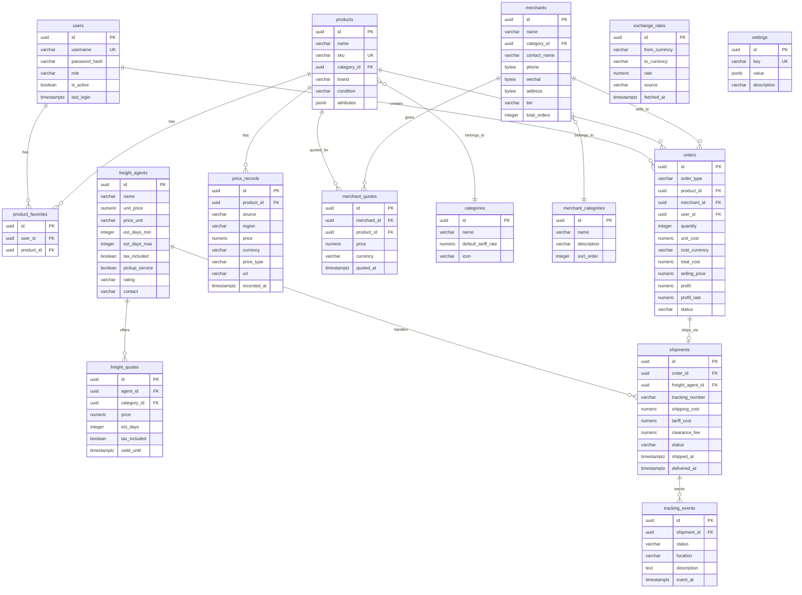

# North Link 跨境货源通 — 数据库设计文档

> 版本: V1.0 | 更新时间: 2026-02-28 | 作者: Bob (System Architect)
>
> 依赖: [系统架构](../architecture/system-architecture.md) | [Sprint 计划](../sprints/sprint-plan.md)

---

## 1. 概述

### 1.1 数据库类型

| 项目     | 值                     |
| -------- | ---------------------- |
| RDBMS    | PostgreSQL 16          |
| 字符集   | UTF-8                  |
| 缓存     | Redis 7                |
| ORM      | SQLAlchemy 2.0 (async) |
| 迁移工具 | Alembic                |
| 驱动     | asyncpg                |

### 1.2 命名规范

| 规则     | 格式                  | 示例                        |
| -------- | --------------------- | --------------------------- |
| 表名     | 小写复数 snake_case   | `products`, `price_records` |
| 字段名   | snake_case            | `created_at`, `category_id` |
| 主键     | `id` (UUID)           | `id UUID PRIMARY KEY`       |
| 外键     | `{entity}_id`         | `product_id`, `merchant_id` |
| 时间戳   | `_at` 后缀            | `created_at`, `updated_at`  |
| 布尔值   | `is_` 前缀            | `is_active`, `is_deleted`   |
| 枚举     | 小写下划线            | `'new'`, `'in_transit'`     |
| 索引     | `ix_{table}_{column}` | `ix_products_sku`           |
| 唯一约束 | `uq_{table}_{column}` | `uq_users_username`         |

### 1.3 通用字段

所有表包含以下基础字段：

```sql
id          UUID PRIMARY KEY DEFAULT gen_random_uuid(),
created_at  TIMESTAMPTZ NOT NULL DEFAULT now(),
updated_at  TIMESTAMPTZ NOT NULL DEFAULT now()
```

`updated_at` 通过 SQLAlchemy `onupdate=func.now()` 自动更新。

---

## 2. ER 图



---

## 3. 表结构

### 3.1 users — 用户

| 字段          | 类型         | 约束                          | 说明               |
| ------------- | ------------ | ----------------------------- | ------------------ |
| id            | UUID         | PK, DEFAULT gen_random_uuid() | 主键               |
| username      | VARCHAR(50)  | NOT NULL, UNIQUE              | 用户名             |
| password_hash | VARCHAR(255) | NOT NULL                      | bcrypt 哈希密码    |
| role          | VARCHAR(20)  | NOT NULL, DEFAULT 'user'      | 角色: admin / user |
| is_active     | BOOLEAN      | NOT NULL, DEFAULT true        | 是否激活           |
| created_at    | TIMESTAMPTZ  | NOT NULL, DEFAULT now()       | 创建时间           |
| updated_at    | TIMESTAMPTZ  | NOT NULL, DEFAULT now()       | 更新时间           |
| last_login    | TIMESTAMPTZ  | NULLABLE                      | 最后登录时间       |

**索引**: `uq_users_username` (username, UNIQUE)

---

### 3.2 products — 商品

| 字段        | 类型         | 约束                         | 说明                                 |
| ----------- | ------------ | ---------------------------- | ------------------------------------ |
| id          | UUID         | PK                           | 主键                                 |
| name        | VARCHAR(200) | NOT NULL                     | 商品名称                             |
| sku         | VARCHAR(100) | NOT NULL, UNIQUE             | SKU 编码                             |
| category_id | UUID         | FK → categories.id, NOT NULL | 所属品类                             |
| brand       | VARCHAR(100) | NULLABLE                     | 品牌                                 |
| condition   | VARCHAR(20)  | NOT NULL, DEFAULT 'new'      | 状态: new/used/refurbished/clearance |
| attributes  | JSONB        | DEFAULT '{}'                 | 灵活属性 (型号、规格等)              |
| created_at  | TIMESTAMPTZ  | NOT NULL, DEFAULT now()      | 创建时间                             |
| updated_at  | TIMESTAMPTZ  | NOT NULL, DEFAULT now()      | 更新时间                             |

**索引**: `uq_products_sku` (sku, UNIQUE), `ix_products_category_id` (category_id), `ix_products_name` (name, GIN trigram 用于模糊搜索)

---

### 3.3 categories — 商品品类

| 字段                | 类型         | 约束                    | 说明       |
| ------------------- | ------------ | ----------------------- | ---------- |
| id                  | UUID         | PK                      | 主键       |
| name                | VARCHAR(50)  | NOT NULL, UNIQUE        | 品类名称   |
| default_tariff_rate | NUMERIC(5,4) | NOT NULL, DEFAULT 0.16  | 默认关税率 |
| icon                | VARCHAR(50)  | NULLABLE                | 图标标识   |
| created_at          | TIMESTAMPTZ  | NOT NULL, DEFAULT now() | 创建时间   |
| updated_at          | TIMESTAMPTZ  | NOT NULL, DEFAULT now() | 更新时间   |

**初始种子数据**:

| name     | default_tariff_rate | icon |
| -------- | ------------------- | ---- |
| 显卡     | 0.16                | 🎮   |
| 电脑硬件 | 0.16                | 💻   |
| 苹果产品 | 0.16                | 🍎   |
| 保健品   | 0.08                | 💊   |
| 母婴     | 0.10                | 🍼   |
| 美妆     | 0.08                | 💄   |
| 海鲜     | 0.10                | 🦐   |
| 家电     | 0.16                | 🏠   |

---

### 3.4 price_records — 价格记录

| 字段        | 类型          | 约束                                          | 说明                                           |
| ----------- | ------------- | --------------------------------------------- | ---------------------------------------------- |
| id          | UUID          | PK                                            | 主键                                           |
| product_id  | UUID          | FK → products.id, NOT NULL, ON DELETE CASCADE | 关联商品                                       |
| source      | VARCHAR(50)   | NOT NULL                                      | 来源: amazon/bestbuy/costco/walmart/manual/csv |
| region      | VARCHAR(5)    | NOT NULL                                      | 地区: CA / CN                                  |
| price       | NUMERIC(12,2) | NOT NULL                                      | 价格                                           |
| currency    | VARCHAR(3)    | NOT NULL                                      | 货币: CAD / CNY                                |
| price_type  | VARCHAR(20)   | NOT NULL, DEFAULT 'retail'                    | 类型: retail/wholesale/buyback                 |
| url         | VARCHAR(500)  | NULLABLE                                      | 来源链接                                       |
| recorded_at | TIMESTAMPTZ   | NOT NULL, DEFAULT now()                       | 记录时间                                       |
| created_at  | TIMESTAMPTZ   | NOT NULL, DEFAULT now()                       | 创建时间                                       |

**索引**: `ix_price_records_product_region` (product_id, region), `ix_price_records_recorded_at` (recorded_at DESC), `ix_price_records_source` (source)

---

### 3.5 product_favorites — 商品收藏

| 字段       | 类型        | 约束                                          | 说明     |
| ---------- | ----------- | --------------------------------------------- | -------- |
| id         | UUID        | PK                                            | 主键     |
| user_id    | UUID        | FK → users.id, NOT NULL, ON DELETE CASCADE    | 用户     |
| product_id | UUID        | FK → products.id, NOT NULL, ON DELETE CASCADE | 商品     |
| created_at | TIMESTAMPTZ | NOT NULL, DEFAULT now()                       | 收藏时间 |

**索引**: `uq_favorites_user_product` (user_id, product_id, UNIQUE)

---

### 3.6 merchants — 商户

| 字段         | 类型         | 约束                        | 说明                         |
| ------------ | ------------ | --------------------------- | ---------------------------- |
| id           | UUID         | PK                          | 主键                         |
| name         | VARCHAR(100) | NOT NULL                    | 商户名称                     |
| category_id  | UUID         | FK → merchant_categories.id | 主营品类                     |
| contact_name | VARCHAR(50)  | NULLABLE                    | 联系人姓名                   |
| phone        | BYTEA        | NULLABLE                    | 手机号 (AES-256 加密)        |
| wechat       | BYTEA        | NULLABLE                    | 微信号 (AES-256 加密)        |
| address      | BYTEA        | NULLABLE                    | 地址 (AES-256 加密)          |
| tier         | VARCHAR(10)  | NOT NULL, DEFAULT 'bronze'  | 合作等级: gold/silver/bronze |
| total_orders | INTEGER      | NOT NULL, DEFAULT 0         | 历史订单数                   |
| created_at   | TIMESTAMPTZ  | NOT NULL, DEFAULT now()     | 创建时间                     |
| updated_at   | TIMESTAMPTZ  | NOT NULL, DEFAULT now()     | 更新时间                     |

> **安全**: phone, wechat, address 使用 AES-256-CBC 加密存储, 密钥为环境变量 `ENCRYPTION_KEY`

**索引**: `ix_merchants_category_id` (category_id), `ix_merchants_tier` (tier)

---

### 3.7 merchant_categories — 商户品类

| 字段        | 类型         | 约束                    | 说明     |
| ----------- | ------------ | ----------------------- | -------- |
| id          | UUID         | PK                      | 主键     |
| name        | VARCHAR(50)  | NOT NULL, UNIQUE        | 品类名称 |
| description | VARCHAR(200) | NULLABLE                | 描述     |
| sort_order  | INTEGER      | NOT NULL, DEFAULT 0     | 排序序号 |
| created_at  | TIMESTAMPTZ  | NOT NULL, DEFAULT now() | 创建时间 |

**初始种子数据**: 显卡/算力, 数码电子, 保健品/母婴, 生鲜/海鲜

---

### 3.8 merchant_quotes — 商户报价

| 字段        | 类型          | 约束                                           | 说明     |
| ----------- | ------------- | ---------------------------------------------- | -------- |
| id          | UUID          | PK                                             | 主键     |
| merchant_id | UUID          | FK → merchants.id, NOT NULL, ON DELETE CASCADE | 商户     |
| product_id  | UUID          | FK → products.id, NOT NULL, ON DELETE CASCADE  | 商品     |
| price       | NUMERIC(12,2) | NOT NULL                                       | 报价     |
| currency    | VARCHAR(3)    | NOT NULL, DEFAULT 'CNY'                        | 货币     |
| quoted_at   | TIMESTAMPTZ   | NOT NULL, DEFAULT now()                        | 报价时间 |
| created_at  | TIMESTAMPTZ   | NOT NULL, DEFAULT now()                        | 创建时间 |

**索引**: `ix_merchant_quotes_merchant_product` (merchant_id, product_id), `ix_merchant_quotes_product_price` (product_id, price DESC) — 用于快速查找最高报价

---

### 3.9 freight_agents — 货代

| 字段           | 类型          | 约束                    | 说明               |
| -------------- | ------------- | ----------------------- | ------------------ |
| id             | UUID          | PK                      | 主键               |
| name           | VARCHAR(100)  | NOT NULL                | 货代名称           |
| unit_price     | NUMERIC(10,2) | NOT NULL                | 单价               |
| price_unit     | VARCHAR(10)   | NOT NULL, DEFAULT 'kg'  | 计价单位: kg/piece |
| est_days_min   | INTEGER       | NOT NULL                | 最短时效(天)       |
| est_days_max   | INTEGER       | NOT NULL                | 最长时效(天)       |
| tax_included   | BOOLEAN       | NOT NULL, DEFAULT false | 是否包税           |
| pickup_service | BOOLEAN       | NOT NULL, DEFAULT false | 是否上门取件       |
| rating         | VARCHAR(5)    | NOT NULL, DEFAULT 'B'   | 评级: A/B/C        |
| contact        | VARCHAR(200)  | NULLABLE                | 联系方式           |
| created_at     | TIMESTAMPTZ   | NOT NULL, DEFAULT now() | 创建时间           |
| updated_at     | TIMESTAMPTZ   | NOT NULL, DEFAULT now() | 更新时间           |

**索引**: `ix_freight_agents_rating` (rating)

---

### 3.10 freight_quotes — 货代报价

| 字段         | 类型          | 约束                                                | 说明         |
| ------------ | ------------- | --------------------------------------------------- | ------------ |
| id           | UUID          | PK                                                  | 主键         |
| agent_id     | UUID          | FK → freight_agents.id, NOT NULL, ON DELETE CASCADE | 货代         |
| category_id  | UUID          | FK → categories.id, NOT NULL                        | 商品品类     |
| price        | NUMERIC(10,2) | NOT NULL                                            | 报价         |
| est_days     | INTEGER       | NOT NULL                                            | 预计时效(天) |
| tax_included | BOOLEAN       | NOT NULL, DEFAULT false                             | 是否包税     |
| valid_until  | TIMESTAMPTZ   | NULLABLE                                            | 报价有效期   |
| created_at   | TIMESTAMPTZ   | NOT NULL, DEFAULT now()                             | 创建时间     |

**索引**: `ix_freight_quotes_agent_category` (agent_id, category_id)

---

### 3.11 orders — 订单 (P1)

| 字段          | 类型          | 约束                        | 说明                |
| ------------- | ------------- | --------------------------- | ------------------- |
| id            | UUID          | PK                          | 主键                |
| order_type    | VARCHAR(10)   | NOT NULL                    | 类型: purchase/sale |
| product_id    | UUID          | FK → products.id, NOT NULL  | 商品                |
| merchant_id   | UUID          | FK → merchants.id, NOT NULL | 商户                |
| user_id       | UUID          | FK → users.id, NOT NULL     | 创建用户            |
| quantity      | INTEGER       | NOT NULL, DEFAULT 1         | 数量                |
| unit_cost     | NUMERIC(12,2) | NOT NULL                    | 单价                |
| cost_currency | VARCHAR(3)    | NOT NULL, DEFAULT 'CAD'     | 成本货币            |
| total_cost    | NUMERIC(12,2) | NOT NULL                    | 总成本              |
| selling_price | NUMERIC(12,2) | NULLABLE                    | 售价                |
| profit        | NUMERIC(12,2) | NULLABLE                    | 利润                |
| profit_rate   | NUMERIC(5,4)  | NULLABLE                    | 利润率              |
| status        | VARCHAR(20)   | NOT NULL, DEFAULT 'draft'   | 状态                |
| created_at    | TIMESTAMPTZ   | NOT NULL, DEFAULT now()     | 创建时间            |
| updated_at    | TIMESTAMPTZ   | NOT NULL, DEFAULT now()     | 更新时间            |

**状态机**: `draft` → `confirmed` → `shipped` → `delivered` → `completed`

**索引**: `ix_orders_user_id` (user_id), `ix_orders_status` (status), `ix_orders_created_at` (created_at DESC), `ix_orders_product_id` (product_id)

---

### 3.12 shipments — 物流

| 字段             | 类型          | 约束                             | 说明           |
| ---------------- | ------------- | -------------------------------- | -------------- |
| id               | UUID          | PK                               | 主键           |
| order_id         | UUID          | FK → orders.id, NOT NULL, UNIQUE | 关联订单 (1:1) |
| freight_agent_id | UUID          | FK → freight_agents.id, NOT NULL | 货代           |
| tracking_number  | VARCHAR(100)  | NULLABLE                         | 运单号         |
| shipping_cost    | NUMERIC(10,2) | NOT NULL                         | 运费           |
| tariff_cost      | NUMERIC(10,2) | NOT NULL, DEFAULT 0              | 关税           |
| clearance_fee    | NUMERIC(10,2) | NOT NULL, DEFAULT 0              | 清关费         |
| status           | VARCHAR(20)   | NOT NULL, DEFAULT 'pending'      | 状态           |
| shipped_at       | TIMESTAMPTZ   | NULLABLE                         | 发货时间       |
| delivered_at     | TIMESTAMPTZ   | NULLABLE                         | 签收时间       |
| created_at       | TIMESTAMPTZ   | NOT NULL, DEFAULT now()          | 创建时间       |
| updated_at       | TIMESTAMPTZ   | NOT NULL, DEFAULT now()          | 更新时间       |

**状态机**: `pending` → `picked_up` → `in_transit` → `customs` → `delivering` → `delivered`

**索引**: `uq_shipments_order_id` (order_id, UNIQUE), `ix_shipments_status` (status), `ix_shipments_tracking` (tracking_number)

---

### 3.13 tracking_events — 物流轨迹

| 字段        | 类型         | 约束                                           | 说明     |
| ----------- | ------------ | ---------------------------------------------- | -------- |
| id          | UUID         | PK                                             | 主键     |
| shipment_id | UUID         | FK → shipments.id, NOT NULL, ON DELETE CASCADE | 关联物流 |
| status      | VARCHAR(50)  | NOT NULL                                       | 事件状态 |
| location    | VARCHAR(200) | NULLABLE                                       | 位置     |
| description | TEXT         | NULLABLE                                       | 描述     |
| event_at    | TIMESTAMPTZ  | NOT NULL                                       | 事件时间 |
| created_at  | TIMESTAMPTZ  | NOT NULL, DEFAULT now()                        | 创建时间 |

**索引**: `ix_tracking_events_shipment_at` (shipment_id, event_at DESC)

---

### 3.14 exchange_rates — 汇率记录

| 字段          | 类型          | 约束                                     | 说明           |
| ------------- | ------------- | ---------------------------------------- | -------------- |
| id            | UUID          | PK                                       | 主键           |
| from_currency | VARCHAR(3)    | NOT NULL                                 | 源货币 (CAD)   |
| to_currency   | VARCHAR(3)    | NOT NULL                                 | 目标货币 (CNY) |
| rate          | NUMERIC(10,6) | NOT NULL                                 | 汇率           |
| source        | VARCHAR(50)   | NOT NULL, DEFAULT 'exchangerate-api.com' | 数据源         |
| fetched_at    | TIMESTAMPTZ   | NOT NULL, DEFAULT now()                  | 获取时间       |

> **Redis 缓存策略**: 实时查询走 Redis (TTL 4h)，每次获取新汇率同时写入 DB 做历史记录。

**索引**: `ix_exchange_rates_pair_time` (from_currency, to_currency, fetched_at DESC)

---

### 3.15 settings — 系统设置

| 字段        | 类型         | 约束                    | 说明     |
| ----------- | ------------ | ----------------------- | -------- |
| id          | UUID         | PK                      | 主键     |
| key         | VARCHAR(100) | NOT NULL, UNIQUE        | 设置键   |
| value       | JSONB        | NOT NULL                | 设置值   |
| description | VARCHAR(200) | NULLABLE                | 描述     |
| updated_at  | TIMESTAMPTZ  | NOT NULL, DEFAULT now() | 更新时间 |

> **关税优先级规则**: SETTINGS 中 `tariff_rate_{category}` 覆盖 CATEGORY.default_tariff_rate。

**初始种子数据**:

| key                     | value                               | description       |
| ----------------------- | ----------------------------------- | ----------------- |
| tariff_rate_electronics | `{"rate": 0.16}`                    | 电子产品关税率    |
| tariff_rate_health      | `{"rate": 0.08}`                    | 保健品/美妆关税率 |
| tariff_rate_baby        | `{"rate": 0.10}`                    | 母婴/日用关税率   |
| tariff_rate_seafood     | `{"rate": 0.10}`                    | 生鲜关税率        |
| default_clearance_fee   | `{"amount": 50, "currency": "CAD"}` | 默认清关费        |
| default_misc_fee        | `{"amount": 20, "currency": "CAD"}` | 默认杂费          |

---

## 4. 索引策略

### 4.1 索引总表

| 表                | 索引名                           | 字段                                        | 类型          | 用途         |
| ----------------- | -------------------------------- | ------------------------------------------- | ------------- | ------------ |
| users             | uq_users_username                | username                                    | UNIQUE        | 登录查询     |
| products          | uq_products_sku                  | sku                                         | UNIQUE        | SKU 唯一     |
| products          | ix_products_category_id          | category_id                                 | BTREE         | 按品类筛选   |
| products          | ix_products_name                 | name                                        | GIN (trigram) | 模糊搜索     |
| price_records     | ix_price_records_product_region  | product_id, region                          | BTREE         | 比价查询核心 |
| price_records     | ix_price_records_recorded_at     | recorded_at DESC                            | BTREE         | 时间排序     |
| product_favorites | uq_favorites_user_product        | user_id, product_id                         | UNIQUE        | 防重复收藏   |
| merchants         | ix_merchants_category_id         | category_id                                 | BTREE         | 按品类筛选   |
| merchant_quotes   | ix_merchant_quotes_product_price | product_id, price DESC                      | BTREE         | 最高报价查询 |
| orders            | ix_orders_user_id                | user_id                                     | BTREE         | 用户订单列表 |
| orders            | ix_orders_created_at             | created_at DESC                             | BTREE         | 时间排序     |
| shipments         | ix_shipments_status              | status                                      | BTREE         | 在途筛选     |
| tracking_events   | ix_tracking_events_shipment_at   | shipment_id, event_at DESC                  | BTREE         | 轨迹时间线   |
| exchange_rates    | ix_exchange_rates_pair_time      | from_currency, to_currency, fetched_at DESC | BTREE         | 最新汇率查询 |

### 4.2 索引原则

- 仅为高频查询路径创建索引，避免过度索引
- 组合索引遵循最左前缀原则
- JSONB 字段暂不创建 GIN 索引 (数据量小，全表扫描即可)
- 商品名称使用 `pg_trgm` 扩展做模糊搜索

---

## 5. 数据字典

### 5.1 枚举值

| 字段                      | 可选值                                                                                  | 说明     |
| ------------------------- | --------------------------------------------------------------------------------------- | -------- |
| products.condition        | `new`, `used`, `refurbished`, `clearance`                                               | 商品状态 |
| price_records.source      | `amazon`, `bestbuy`, `costco`, `walmart`, `canada_computers`, `newegg`, `manual`, `csv` | 数据来源 |
| price_records.region      | `CA`, `CN`                                                                              | 价格地区 |
| price_records.currency    | `CAD`, `CNY`                                                                            | 货币     |
| price_records.price_type  | `retail`, `wholesale`, `buyback`                                                        | 价格类型 |
| merchants.tier            | `gold`, `silver`, `bronze`                                                              | 商户等级 |
| freight_agents.rating     | `A`, `B`, `C`                                                                           | 货代评级 |
| freight_agents.price_unit | `kg`, `piece`                                                                           | 计价单位 |
| orders.order_type         | `purchase`, `sale`                                                                      | 订单类型 |
| orders.status             | `draft`, `confirmed`, `shipped`, `delivered`, `completed`                               | 订单状态 |
| shipments.status          | `pending`, `picked_up`, `in_transit`, `customs`, `delivering`, `delivered`              | 物流状态 |
| users.role                | `admin`, `user`                                                                         | 用户角色 |

### 5.2 状态流转

#### 订单状态

```
draft → confirmed → shipped → delivered → completed
```

#### 物流状态

```
pending → picked_up → in_transit → customs → delivering → delivered
```

---

## 6. 外键与级联规则

| 子表              | 外键             | 父表                | ON DELETE |
| ----------------- | ---------------- | ------------------- | --------- |
| products          | category_id      | categories          | RESTRICT  |
| price_records     | product_id       | products            | CASCADE   |
| product_favorites | user_id          | users               | CASCADE   |
| product_favorites | product_id       | products            | CASCADE   |
| merchants         | category_id      | merchant_categories | SET NULL  |
| merchant_quotes   | merchant_id      | merchants           | CASCADE   |
| merchant_quotes   | product_id       | products            | CASCADE   |
| freight_quotes    | agent_id         | freight_agents      | CASCADE   |
| freight_quotes    | category_id      | categories          | RESTRICT  |
| orders            | product_id       | products            | RESTRICT  |
| orders            | merchant_id      | merchants           | RESTRICT  |
| orders            | user_id          | users               | RESTRICT  |
| shipments         | order_id         | orders              | RESTRICT  |
| shipments         | freight_agent_id | freight_agents      | RESTRICT  |
| tracking_events   | shipment_id      | shipments           | CASCADE   |

**原则**:

- **CASCADE**: 子数据无独立价值 (收藏、报价、轨迹)
- **RESTRICT**: 子数据有业务意义，不能随父删除 (订单不能因商品删除而丢失)
- **SET NULL**: 弱关联 (商户品类删除后商户仍存在)

---

## 7. 性能考虑

### 7.1 数据量预估 (MVP 1 年)

| 表              | 预估行数        | 增长速率 |
| --------------- | --------------- | -------- |
| products        | 1,000 - 5,000   | 50/周    |
| price_records   | 10,000 - 50,000 | 500/周   |
| merchants       | 50 - 200        | 5/周     |
| merchant_quotes | 500 - 2,000     | 50/周    |
| orders          | 500 - 5,000     | 50/周    |
| exchange_rates  | 2,000           | 6/天     |

### 7.2 查询优化

| 查询场景          | 优化策略                                      |
| ----------------- | --------------------------------------------- |
| 比价列表 (最频繁) | 组合索引 product_id+region + Redis 缓存 30min |
| 商户匹配最高报价  | 组合索引 product_id+price DESC                |
| 物流在途列表      | status 索引 + 分页                            |
| 利润报表统计      | created_at 索引 + 数据库聚合函数              |

### 7.3 归档策略

- V1.0: 暂不归档 (数据量小)
- V1.5+: price_records 超过 6 个月的历史记录归档到冷存储

---

## 8. Migration 记录

| 版本 | 描述                                                  | Alembic Revision                                      |
| ---- | ----------------------------------------------------- | ----------------------------------------------------- |
| 001  | 初始 Schema: 全部 15 张表                             | `alembic revision --autogenerate -m "initial_schema"` |
| 002  | 种子数据: categories + merchant_categories + settings | `alembic revision -m "seed_data"`                     |

**执行命令**:

```bash
# 生成迁移
uv run alembic revision --autogenerate -m "initial_schema"

# 执行迁移
uv run alembic upgrade head

# 回滚
uv run alembic downgrade -1
```
