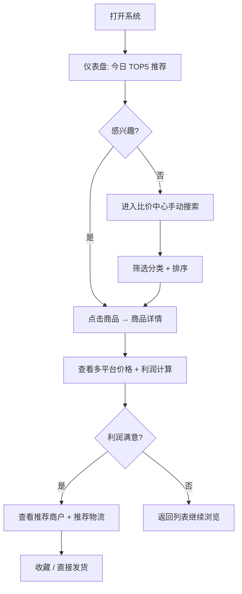
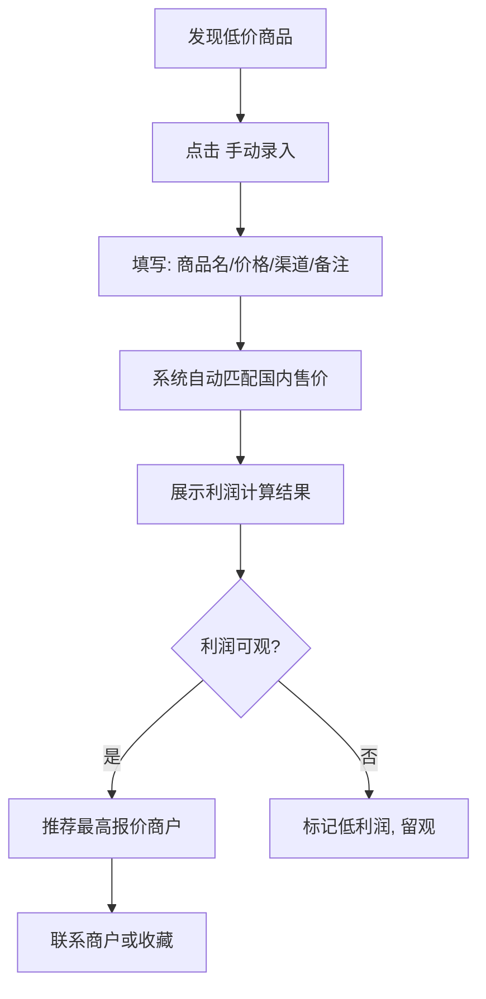
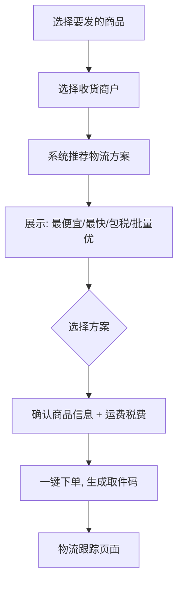
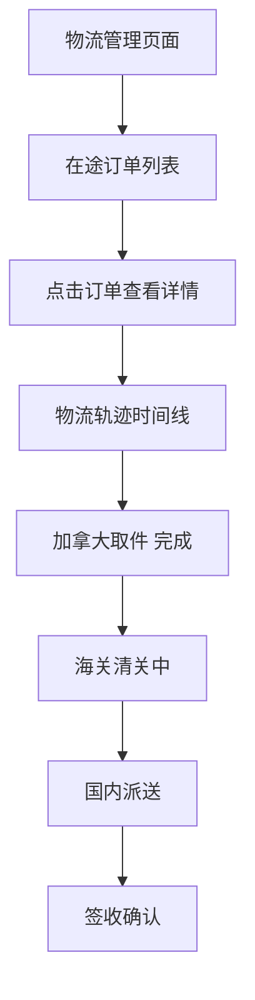
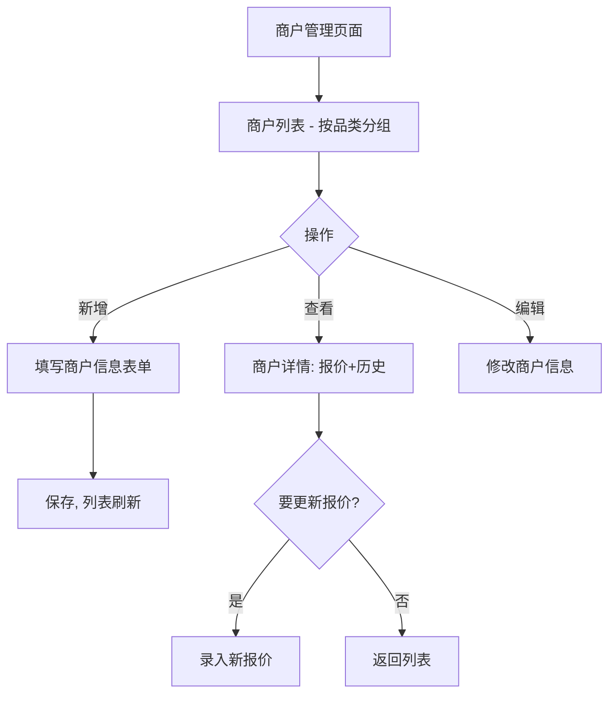
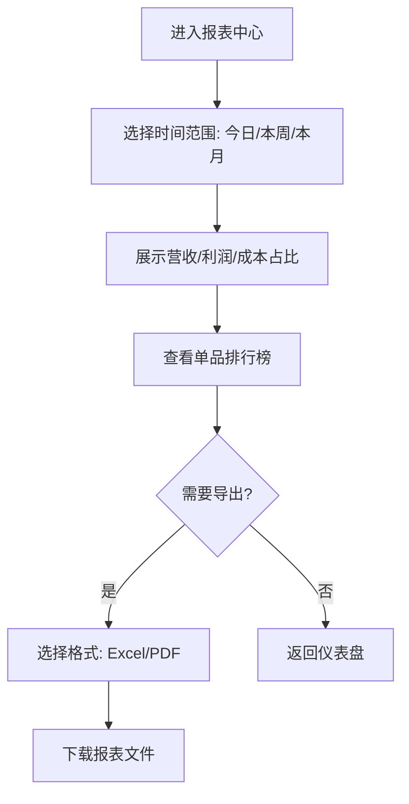
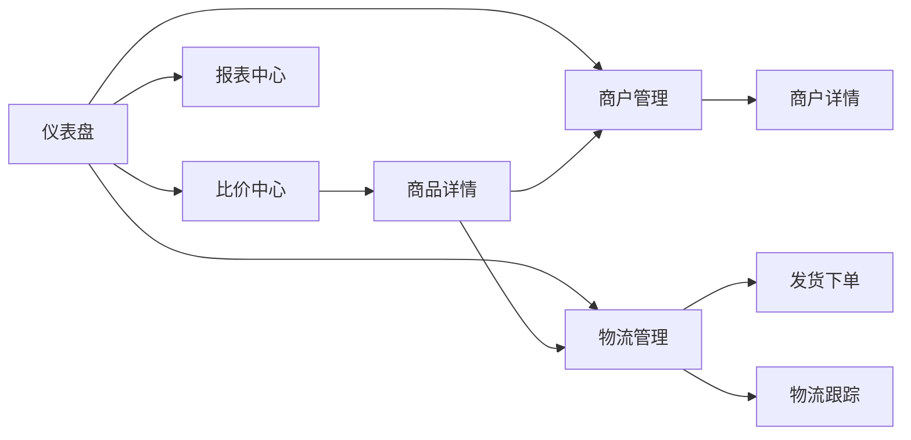

# North Link 跨境货源通 — 用户流程

> 版本: V1.0 | 更新时间: 2026-02-28 | 作者: Bella (UI/UX Designer)

## 1. 核心用户流程

### Flow 1: 每日找货 (S1 — MVP 核心)

### Flow 2: 手动录入发现的低价商品 (S2)

### Flow 3: 安排发货 (S4)

### Flow 4: 物流跟踪 (S5)

### Flow 5: 商户管理

### Flow 6: 查看报表 (S6)

## 2. 页面跳转关系

## 3. 错误与边界场景

| 场景             | 处理方式                        |
| ---------------- | ------------------------------- |
| 无推荐数据       | 空状态: 引导用户手动录入商品    |
| 利润计算参数缺失 | 使用默认参数 + 提示用户去设置页 |
| 国内价格未匹配到 | 提示 "暂无匹配"，允许手动输入   |
| 网络中断         | 离线缓存最近数据 + 重试提示     |
| 物流状态更新延迟 | 展示最后更新时间 + 刷新按钮     |
