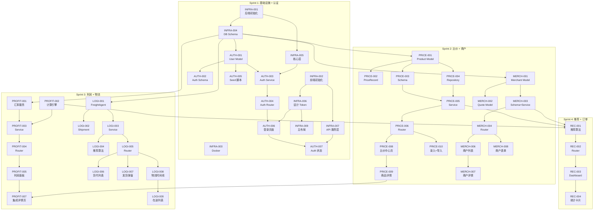

# North Link 跨境货源通 — 开发任务清单

> 版本: V1.0 | 更新时间: 2026-02-28 | 作者: Charlie (Tech Lead)
>
> 依赖: [PRD](../requirements/prd.md) | [系统架构](../architecture/system-architecture.md)

---

## 概览

- **Epic 数量**: 9
- **Story 总数**: 69
- **预估总工时**: 186h
- **Sprint 数**: 5 (每个 Sprint 约 2 周)

## Epic 列表

| Epic | 名称                | Story 数 | 预估工时 | 优先级 | Sprint   |
| ---- | ------------------- | -------- | -------- | ------ | -------- |
| E1   | 项目基础设施        | 9        | 24h      | P0     | Sprint 1 |
| E2   | 用户认证 (模块 8)   | 8        | 16h      | P0     | Sprint 1 |
| E3   | 比价中心 (模块 1)   | 10       | 26h      | P0     | Sprint 2 |
| E4   | 商户管理 (模块 2)   | 8        | 20h      | P0     | Sprint 2 |
| E5   | 利润计算器 (模块 3) | 7        | 16h      | P0     | Sprint 3 |
| E6   | 物流管理 (模块 4)   | 10       | 26h      | P0     | Sprint 3 |
| E7   | 每日推荐 (模块 6)   | 4        | 11h      | P0     | Sprint 4 |
| E8   | 订单与报表 (模块 5) | 8        | 24h      | P1     | Sprint 4 |
| E9   | 系统设置 (模块 7)   | 5        | 20h      | P1     | Sprint 5 |

---

## Epic 详情

---

### Epic 1: 项目基础设施

> 搭建开发环境、数据库、项目骨架。所有后续 Epic 的基础。

| ID        | 标题                                    | 类型     | 优先级 | 预估 | 依赖                 |
| --------- | --------------------------------------- | -------- | ------ | ---- | -------------------- |
| INFRA-001 | 后端项目初始化                          | Backend  | P0     | 2h   | —                    |
| INFRA-002 | 前端项目初始化                          | Frontend | P0     | 2h   | —                    |
| INFRA-003 | Docker Compose 配置                     | DevOps   | P0     | 2h   | —                    |
| INFRA-004 | 数据库 Schema 创建 (Alembic)            | Database | P0     | 6h   | INFRA-001            |
| INFRA-005 | 共享核心层 (auth/exceptions/middleware) | Backend  | P0     | 3h   | INFRA-001            |
| INFRA-006 | 前端设计系统 Token + 全局样式           | Frontend | P0     | 2h   | INFRA-002            |
| INFRA-007 | API 服务层 + Axios 拦截器               | Frontend | P0     | 2h   | INFRA-002            |
| INFRA-008 | CI/CD 基础 (GitHub Actions lint + test) | DevOps   | P1     | 1h   | INFRA-001, INFRA-002 |
| INFRA-009 | 主布局 AppLayout + Sidebar + MobileNav  | Frontend | P0     | 4h   | INFRA-006            |

---

### Epic 2: 用户认证 (模块 8)

> PRD: US-801 登录、US-802 密码管理。JWT Token 认证。

| ID       | 标题                                         | 类型      | 优先级 | 预估 | 依赖                |
| -------- | -------------------------------------------- | --------- | ------ | ---- | ------------------- |
| AUTH-001 | User Model + Migration                       | Backend   | P0     | 2h   | INFRA-004           |
| AUTH-002 | Auth Schema (Login/Token/UserResponse)       | Backend   | P0     | 1h   | AUTH-001            |
| AUTH-003 | Auth Service (login/verify/refresh)          | Backend   | P0     | 3h   | AUTH-001, INFRA-005 |
| AUTH-004 | Auth Router (POST /login, /refresh, GET /me) | Backend   | P0     | 2h   | AUTH-003            |
| AUTH-005 | CLI Seed 脚本 (create_admin)                 | Backend   | P0     | 1h   | AUTH-001            |
| AUTH-006 | 登录页面 + 表单                              | Frontend  | P0     | 3h   | AUTH-004, INFRA-006 |
| AUTH-007 | Auth 状态管理 + 路由守卫                     | Frontend  | P0     | 2h   | AUTH-006, INFRA-007 |
| AUTH-008 | 密码修改功能                                 | Fullstack | P0     | 2h   | AUTH-003, AUTH-006  |

---

### Epic 3: 比价中心 (模块 1)

> PRD: US-101 最低价、US-102 筛选排序、US-103 收藏、US-104 手动录入、US-105 CSV 导入。

| ID        | 标题                                                | 类型     | 优先级 | 预估 | 依赖                 |
| --------- | --------------------------------------------------- | -------- | ------ | ---- | -------------------- |
| PRICE-001 | Product + Category Model + Migration                | Backend  | P0     | 2h   | INFRA-004            |
| PRICE-002 | PriceRecord Model + Migration                       | Backend  | P0     | 1h   | PRICE-001            |
| PRICE-003 | Price Schema (ProductList/Detail/Manual/CSV)        | Backend  | P0     | 2h   | PRICE-001            |
| PRICE-004 | Price Repository (CRUD + 筛选/排序/分页)            | Backend  | P0     | 3h   | PRICE-001, PRICE-002 |
| PRICE-005 | Price Service (列表/详情/手动录入/CSV导入)          | Backend  | P0     | 3h   | PRICE-003, PRICE-004 |
| PRICE-006 | Price Router (完整 API: GET/POST/PUT/DELETE/import) | Backend  | P0     | 2h   | PRICE-005            |
| PRICE-007 | Favorite Model + API (收藏/取消收藏/列表)           | Backend  | P0     | 2h   | PRICE-001, AUTH-001  |
| PRICE-008 | 比价中心页面 (商品卡片列表 + 筛选栏)                | Frontend | P0     | 4h   | PRICE-006, INFRA-006 |
| PRICE-009 | 商品详情页 (多平台价格对比 + 收藏)                  | Frontend | P0     | 3h   | PRICE-008, PRICE-007 |
| PRICE-010 | 手动录入 + CSV 导入弹窗                             | Frontend | P0     | 4h   | PRICE-006            |

---

### Epic 4: 商户管理 (模块 2)

> PRD: US-201 国内售价、US-202 商户联系人、US-203 自动匹配最高报价商户。

| ID        | 标题                                          | 类型     | 优先级 | 预估 | 依赖                 |
| --------- | --------------------------------------------- | -------- | ------ | ---- | -------------------- |
| MERCH-001 | Merchant + MerchantCategory Model + Migration | Backend  | P0     | 2h   | INFRA-004            |
| MERCH-002 | MerchantQuote Model + Migration               | Backend  | P0     | 1h   | MERCH-001, PRICE-001 |
| MERCH-003 | Merchant Schema + Service + Repository        | Backend  | P0     | 3h   | MERCH-001, MERCH-002 |
| MERCH-004 | Merchant Router (CRUD + 报价 + 自动匹配)      | Backend  | P0     | 3h   | MERCH-003            |
| MERCH-005 | Merchant 匹配算法 (按商品匹配最高报价商户)    | Backend  | P0     | 2h   | MERCH-003, PRICE-001 |
| MERCH-006 | 商户列表页 (卡片 + 按品类分组)                | Frontend | P0     | 3h   | MERCH-004, INFRA-006 |
| MERCH-007 | 商户详情页 (基本信息 + 报价历史 + 订单历史)   | Frontend | P0     | 3h   | MERCH-006            |
| MERCH-008 | 商户表单 (新增/编辑 + 报价录入)               | Frontend | P0     | 3h   | MERCH-004, MERCH-006 |

---

### Epic 5: 利润计算器 (模块 3)

> PRD: US-301 一键计算纯利润、US-302 自定义参数。

| ID         | 标题                                             | 类型     | 优先级 | 预估 | 依赖                   |
| ---------- | ------------------------------------------------ | -------- | ------ | ---- | ---------------------- |
| PROFIT-001 | ExchangeRate Model + 汇率服务 (Redis 缓存)       | Backend  | P0     | 3h   | INFRA-004, INFRA-005   |
| PROFIT-002 | 利润计算引擎 (calculator.py: 纯函数)             | Backend  | P0     | 2h   | —                      |
| PROFIT-003 | Profit Schema + Service (calculate/batch/params) | Backend  | P0     | 2h   | PROFIT-001, PROFIT-002 |
| PROFIT-004 | Profit Router (POST /calculate, GET/PUT /params) | Backend  | P0     | 2h   | PROFIT-003             |
| PROFIT-005 | 利润面板组件 (ProfitBadge + RiskLevel)           | Frontend | P0     | 2h   | PROFIT-004, INFRA-006  |
| PROFIT-006 | 利润参数编辑表单 (税率/运费模板)                 | Frontend | P0     | 2h   | PROFIT-004             |
| PROFIT-007 | 利润计算集成到商品详情页                         | Frontend | P0     | 3h   | PROFIT-005, PRICE-009  |

---

### Epic 6: 物流管理 (模块 4)

> PRD: US-401 货代管理、US-402 一键发货、US-403 物流跟踪。

| ID       | 标题                                              | 类型     | 优先级 | 预估 | 依赖                 |
| -------- | ------------------------------------------------- | -------- | ------ | ---- | -------------------- |
| LOGI-001 | FreightAgent + FreightQuote Model + Migration     | Backend  | P0     | 2h   | INFRA-004            |
| LOGI-002 | Shipment + TrackingEvent Model + Migration        | Backend  | P0     | 2h   | LOGI-001             |
| LOGI-003 | Logistics Schema + Service + Repository           | Backend  | P0     | 3h   | LOGI-001, LOGI-002   |
| LOGI-004 | 物流推荐算法 (最便宜/最快/包税/批量最优)          | Backend  | P0     | 2h   | LOGI-003, PROFIT-001 |
| LOGI-005 | Logistics Router (货代 CRUD + 推荐 + 发货 + 轨迹) | Backend  | P0     | 3h   | LOGI-003, LOGI-004   |
| LOGI-006 | 货代列表页 (卡片 + 评级 + 报价)                   | Frontend | P0     | 3h   | LOGI-005, INFRA-006  |
| LOGI-007 | 发货下单弹窗 (商品信息 → 自动算费 → 生成取件码)   | Frontend | P0     | 4h   | LOGI-005, PROFIT-005 |
| LOGI-008 | 物流跟踪时间线组件                                | Frontend | P0     | 3h   | LOGI-005             |
| LOGI-009 | 在途物流列表页                                    | Frontend | P0     | 2h   | LOGI-008             |
| LOGI-010 | 货代表单 (新增/编辑货代)                          | Frontend | P0     | 2h   | LOGI-005             |

---

### Epic 7: 每日推荐 (模块 6)

> PRD: US-601 每天 TOP5 高利润商品推荐。

| ID      | 标题                                         | 类型     | 优先级 | 预估 | 依赖                             |
| ------- | -------------------------------------------- | -------- | ------ | ---- | -------------------------------- |
| REC-001 | 推荐算法 Service (利润率排序 + 风险过滤)     | Backend  | P0     | 3h   | PRICE-005, PROFIT-002, MERCH-005 |
| REC-002 | Recommendation Router (GET /daily, /history) | Backend  | P0     | 2h   | REC-001                          |
| REC-003 | Dashboard 页面 (仪表盘 + TOP5 推荐卡片)      | Frontend | P0     | 4h   | REC-002, INFRA-009               |
| REC-004 | Dashboard 统计卡片 (今日毛利/订单数/在途)    | Frontend | P0     | 2h   | REC-003                          |

> **注**: REC-005 (主布局) 已移至 INFRA-009 (Sprint 1)，因为所有前端页面都依赖布局容器。

> **推荐算法说明 (REC-001)**: MVP 阶段使用简单排序公式:
> `score = profit_rate * 0.5 + (1 - risk_factor) * 0.3 + history_count * 0.2`
>
> - `profit_rate`: 利润率 (0-1)
> - `risk_factor`: 风险系数 (0=低, 0.5=中, 1=高)
> - `history_count`: 归一化历史成交量 (0-1)
>   取 TOP5 展示。后续通过 A/B 测试调整权重。

---

### Epic 8: 订单与报表 (模块 5)

> PRD: US-501 采购/销售订单、US-502 利润报表。**P1 优先级**。

| ID        | 标题                                       | 类型     | 优先级 | 预估 | 依赖                            |
| --------- | ------------------------------------------ | -------- | ------ | ---- | ------------------------------- |
| ORDER-001 | Order Model + Migration                    | Backend  | P1     | 2h   | INFRA-004, PRICE-001, MERCH-001 |
| ORDER-002 | Order Schema + Service + Repository        | Backend  | P1     | 3h   | ORDER-001                       |
| ORDER-003 | Order Router (CRUD + 状态更新)             | Backend  | P1     | 2h   | ORDER-002                       |
| ORDER-004 | 报表 Service (日/周/月利润统计 + 单品排行) | Backend  | P1     | 3h   | ORDER-002                       |
| ORDER-005 | 报表 Router (GET /reports + /export)       | Backend  | P1     | 2h   | ORDER-004                       |
| ORDER-006 | 订单列表页 (采购 + 销售 Tab)               | Frontend | P1     | 4h   | ORDER-003                       |
| ORDER-007 | 订单详情 + 创建表单                        | Frontend | P1     | 4h   | ORDER-003, PRICE-008            |
| ORDER-008 | 报表中心页 (折线图 + 饼图 + 排行表)        | Frontend | P1     | 4h   | ORDER-005, REC-003              |

---

### Epic 9: 系统设置 (模块 7)

> PRD: US-701 自定义系统参数。**P1 优先级**。

| ID      | 标题                                  | 类型     | 优先级 | 预估 | 依赖               |
| ------- | ------------------------------------- | -------- | ------ | ---- | ------------------ |
| SET-001 | Settings Model + Service              | Backend  | P1     | 2h   | INFRA-004          |
| SET-002 | Settings Router (GET/PUT /settings)   | Backend  | P1     | 2h   | SET-001            |
| SET-003 | 系统设置页面 (税率/运费模板/商户分类) | Frontend | P1     | 4h   | SET-002            |
| SET-004 | 数据备份导出功能                      | Backend  | P1     | 3h   | SET-001, ORDER-002 |
| SET-005 | 账号权限管理页面                      | Frontend | P1     | 2h   | AUTH-003, SET-002  |

> **关税数据优先级规则 (解决架构 Review MEDIUM #5)**:
> SETTINGS 中的税率覆盖 CATEGORY 的 `default_tariff_rate`。查询优先级:
>
> 1. SETTINGS 中商品所属品类的自定义税率
> 2. CATEGORY.default_tariff_rate 默认税率

> **汇率 DB vs Redis 职责 (解决架构 Review MEDIUM #6)**:
>
> - **Redis**: 热缓存，TTL 4h，所有实时查询走 Redis
> - **PostgreSQL EXCHANGE_RATE**: 历史记录，每次获取新汇率时写入 DB，用于历史趋势分析

---

## Story 详情

---

### [INFRA-001] 后端项目初始化

**类型**: Backend
**Epic**: 项目基础设施
**优先级**: P0
**预估**: 2h

#### 描述

使用 `uv init` 创建 Python 项目，配置 FastAPI + SQLAlchemy + Alembic。

#### 验收标准

- [ ] `backend/` 目录结构与架构文档 3.1 一致
- [ ] `pyproject.toml` 包含核心依赖: fastapi, uvicorn, sqlalchemy, alembic, pydantic, python-jose, passlib, structlog, sentry-sdk
- [ ] `app/main.py` 可启动 FastAPI 应用
- [ ] `app/config.py` 从环境变量读取配置
- [ ] `app/database.py` 配置异步数据库连接
- [ ] `uv run uvicorn app.main:app` 启动成功
- [ ] 访问 `/docs` 显示 OpenAPI 文档

#### 文件

- `backend/pyproject.toml`
- `backend/app/main.py`
- `backend/app/config.py`
- `backend/app/database.py`

---

### [INFRA-002] 前端项目初始化

**类型**: Frontend
**Epic**: 项目基础设施
**优先级**: P0
**预估**: 2h

#### 描述

使用 Vite + React + TypeScript 创建前端项目，安装 Ant Design 5 + Zustand + React Router + Axios + React Query。

#### 验收标准

- [ ] `frontend/` 目录结构与架构文档 3.2 一致
- [ ] `package.json` 包含所有依赖
- [ ] TypeScript 配置严格模式
- [ ] Vite 代理配置 (开发环境 API 转发到 `http://localhost:8000`)
- [ ] `npm run dev` 启动成功
- [ ] `npx tsc --noEmit` 无类型错误

#### 文件

- `frontend/package.json`
- `frontend/tsconfig.json`
- `frontend/vite.config.ts`
- `frontend/src/main.tsx`
- `frontend/src/App.tsx`

---

### [INFRA-003] Docker Compose 配置

**类型**: DevOps
**Epic**: 项目基础设施
**优先级**: P0
**预估**: 2h

#### 描述

创建 Docker Compose 配置，一键启动完整开发环境 (PostgreSQL + Redis + API + Frontend)。

#### 验收标准

- [ ] `docker-compose.yml` 包含 db, redis, api, frontend 四个服务
- [ ] `.env.example` 包含所有必要环境变量
- [ ] `docker compose up -d` 一键启动成功
- [ ] 后端可连接数据库和 Redis

#### 文件

- `docker-compose.yml`
- `.env.example`
- `backend/Dockerfile`
- `frontend/Dockerfile`

---

### [INFRA-004] 数据库 Schema 创建 (Alembic)

**类型**: Database
**Epic**: 项目基础设施
**优先级**: P0
**预估**: 6h

#### 描述

使用 Alembic 创建所有数据表的初始迁移，覆盖架构文档 4.1 中定义的全部 13 个实体。

#### 验收标准

- [ ] Alembic 初始化完成 (`alembic init`)
- [ ] 创建初始迁移文件，包含全部 13 个表:
  - USER, PRODUCT, CATEGORY, PRICE_RECORD, PRODUCT_FAVORITE
  - MERCHANT, MERCHANT_CATEGORY, MERCHANT_QUOTE
  - FREIGHT_AGENT, FREIGHT_QUOTE, ORDER, SHIPMENT, TRACKING_EVENT
  - EXCHANGE_RATE, SETTINGS
- [ ] 所有表包含 `id` (UUID PK), `created_at`, `updated_at`
- [ ] 外键约束正确 (`ON DELETE CASCADE` / `SET NULL`)
- [ ] 索引: PRODUCT.sku (unique), USER.username (unique), PRICE_RECORD.product_id + recorded_at
- [ ] `alembic upgrade head` 执行成功
- [ ] MERCHANT.phone, wechat, address 字段标记为需加密存储

#### 依赖

- [INFRA-001] 后端项目初始化

#### 文件

- `backend/alembic/` (迁移目录)
- `backend/app/modules/*/models.py` (所有 Model 文件)

---

### [INFRA-005] 共享核心层

**类型**: Backend
**Epic**: 项目基础设施
**优先级**: P0
**预估**: 3h

#### 描述

实现所有模块共享的核心功能: JWT 认证依赖、统一异常处理、中间件链。

#### 验收标准

- [ ] `core/auth.py`: JWT 编码/解码、get_current_user 依赖注入
- [ ] `core/exceptions.py`: 自定义异常类 + 统一异常处理器
- [ ] `core/middleware.py`: CORS + 请求日志 (structlog) + 错误处理
- [ ] `core/pagination.py`: 统一分页响应模型 (page, page_size, total, items)
- [ ] `core/exchange_rate.py`: 汇率服务 (Redis 缓存 TTL 4h + ExchangeRate-API fallback)
- [ ] 错误响应统一格式: `{ "detail": "message", "code": "ERROR_CODE" }`

#### 依赖

- [INFRA-001] 后端项目初始化

#### 文件

- `backend/app/core/auth.py`
- `backend/app/core/exceptions.py`
- `backend/app/core/middleware.py`
- `backend/app/core/pagination.py`
- `backend/app/core/exchange_rate.py`

---

### [INFRA-006] 前端设计系统 Token + 全局样式

**类型**: Frontend
**Epic**: 项目基础设施
**优先级**: P0
**预估**: 2h

#### 描述

将 `docs/design/design-system.md` 中定义的设计 token 转化为 CSS 变量，配置 Ant Design 5 主题。

#### 验收标准

- [ ] `index.css` 包含所有 CSS 变量 (颜色、字体、间距、圆角、阴影)
- [ ] Ant Design ConfigProvider 配置自定义主题 token
- [ ] 字体: 标题 Outfit (英文), 正文 Inter (英文), 中文 fallback system-ui
- [ ] 利润指示器色值: `--color-profit-high` (绿), `--color-profit-medium` (黄), `--color-profit-low` (红)
- [ ] 响应式断点: Mobile 768px, Tablet 1024px, Desktop 1440px

#### 依赖

- [INFRA-002] 前端项目初始化

#### 文件

- `frontend/src/index.css`
- `frontend/src/theme.ts` (Ant Design 主题配置)

---

### [INFRA-007] API 服务层 + Axios 拦截器

**类型**: Frontend
**Epic**: 项目基础设施
**优先级**: P0
**预估**: 2h

#### 描述

创建 Axios 实例，配置 JWT Token 注入、刷新 Token、错误统一处理。

#### 验收标准

- [ ] `services/api.ts`: Axios 实例 + baseURL 配置
- [ ] 请求拦截器: 自动注入 `Authorization: Bearer <token>`
- [ ] 响应拦截器: 401 → 尝试刷新 Token → 失败跳转登录
- [ ] 错误拦截器: 统一 Toast 提示 (Ant Design message)
- [ ] React Query 全局配置 (QueryClient: staleTime, retry)

#### 依赖

- [INFRA-002] 前端项目初始化

#### 文件

- `frontend/src/services/api.ts`
- `frontend/src/providers/QueryProvider.tsx`

---

### [INFRA-008] CI/CD 基础

**类型**: DevOps
**Epic**: 项目基础设施
**优先级**: P1
**预估**: 1h

#### 描述

配置 GitHub Actions: lint (ruff + eslint) + 单元测试 (pytest + vitest)。

#### 验收标准

- [ ] `.github/workflows/ci.yml` 配置 lint + test 步骤
- [ ] 后端: `uv run ruff check .` + `uv run pytest`
- [ ] 前端: `npm run lint` + `npx tsc --noEmit`
- [ ] PR 触发自动检查

#### 依赖

- [INFRA-001], [INFRA-002]

#### 文件

- `.github/workflows/ci.yml`

---

### [AUTH-001] User Model + Migration

**类型**: Backend
**Epic**: 用户认证
**User Story**: US-801 登录
**优先级**: P0
**预估**: 2h

#### 描述

创建用户数据模型 (与架构 4.1 USER 实体对齐)。

#### 验收标准

- [ ] 创建 `app/modules/auth/models.py`
- [ ] 字段: id (UUID), username (unique), password_hash, role (admin/user), is_active, created_at, last_login
- [ ] 索引: username (unique)
- [ ] Alembic 迁移文件生成

#### 依赖

- [INFRA-004] 数据库 Schema

#### 文件

- `backend/app/modules/auth/models.py`

---

### [AUTH-002] Auth Schema

**类型**: Backend
**Epic**: 用户认证
**优先级**: P0
**预估**: 1h

#### 描述

定义登录请求/响应、Token、用户信息的 Pydantic 模型。

#### 验收标准

- [ ] `LoginRequest`: username, password
- [ ] `TokenResponse`: access_token, refresh_token, token_type
- [ ] `UserResponse`: id, username, role, is_active, created_at
- [ ] `PasswordChangeRequest`: old_password, new_password

#### 依赖

- [AUTH-001]

#### 文件

- `backend/app/modules/auth/schemas.py`

---

### [AUTH-003] Auth Service

**类型**: Backend
**Epic**: 用户认证
**优先级**: P0
**预估**: 3h

#### 描述

实现认证业务逻辑: 登录、Token 生成/验证/刷新、密码修改。

#### 验收标准

- [ ] `authenticate(username, password)` → 验证密码 (bcrypt)
- [ ] `create_access_token(user_id)` → JWT (30min)
- [ ] `create_refresh_token(user_id)` → JWT (7d)
- [ ] `verify_token(token)` → user_id
- [ ] `refresh_access_token(refresh_token)` → new access_token
- [ ] `change_password(user_id, old, new)` → 验证旧密码 + 更新
- [ ] 登录失败返回明确错误信息

#### 依赖

- [AUTH-001], [INFRA-005]

#### 文件

- `backend/app/modules/auth/service.py`

---

### [AUTH-004] Auth Router

**类型**: Backend
**Epic**: 用户认证
**优先级**: P0
**预估**: 2h

#### 描述

实现认证 API 端点。

#### 验收标准

- [ ] `POST /api/v1/auth/login` → TokenResponse
- [ ] `POST /api/v1/auth/refresh` → TokenResponse
- [ ] `GET /api/v1/auth/me` → UserResponse (需认证)
- [ ] `PUT /api/v1/auth/password` → 204 (需认证)
- [ ] 所有端点在 `/docs` 中可见

#### 依赖

- [AUTH-003]

#### 文件

- `backend/app/modules/auth/router.py`

---

### [AUTH-005] CLI Seed 脚本

**类型**: Backend
**Epic**: 用户认证
**优先级**: P0
**预估**: 1h

#### 描述

创建管理员账号的 CLI 脚本 (首次部署使用)。

#### 验收标准

- [ ] `uv run python -m app.scripts.create_admin --username admin --password <pwd>` 创建管理员
- [ ] 已存在时提示 "Admin already exists"，不重复创建
- [ ] 密码使用 bcrypt 哈希
- [ ] Docker entrypoint 自动调用

#### 依赖

- [AUTH-001]

#### 文件

- `backend/app/scripts/create_admin.py`

---

### [AUTH-006] 登录页面 + 表单

**类型**: Frontend
**Epic**: 用户认证
**User Story**: US-801 登录
**优先级**: P0
**预估**: 3h

#### 描述

实现登录页面，包含用户名/密码输入和提交。

#### 验收标准

- [ ] 登录表单: 用户名 + 密码 + 登录按钮
- [ ] 表单验证: 用户名必填、密码必填 (≥6 位)
- [ ] 登录成功 → 跳转 Dashboard
- [ ] 登录失败 → 显示错误提示
- [ ] UI 设计与 `docs/design/wireframes.md` 一致
- [ ] 响应式: 移动端居中卡片

#### 依赖

- [AUTH-004], [INFRA-006]

#### 文件

- `frontend/src/pages/Login/Login.tsx`
- `frontend/src/services/authService.ts`

---

### [AUTH-007] Auth 状态管理 + 路由守卫

**类型**: Frontend
**Epic**: 用户认证
**优先级**: P0
**预估**: 2h

#### 描述

使用 Zustand 管理认证状态，实现路由守卫。

#### 验收标准

- [ ] `stores/useAuthStore.ts`: token, user, login(), logout(), isAuthenticated
- [ ] Token 存储在 localStorage (access_token + refresh_token)
- [ ] `ProtectedRoute` 组件: 未登录 → 跳转 `/login`
- [ ] 页面刷新后自动尝试恢复认证状态 (refresh token)

#### 依赖

- [AUTH-006], [INFRA-007]

#### 文件

- `frontend/src/stores/useAuthStore.ts`
- `frontend/src/components/auth/ProtectedRoute.tsx`

---

### [AUTH-008] 密码修改功能

**类型**: Fullstack
**Epic**: 用户认证
**User Story**: US-802 密码管理
**优先级**: P0
**预估**: 2h

#### 描述

实现密码修改功能 (前端表单 + 后端 API)。

#### 验收标准

- [ ] 设置页面内嵌密码修改表单
- [ ] 输入: 旧密码 + 新密码 + 确认新密码
- [ ] 验证: 新密码与确认密码一致，新密码 ≥6 位
- [ ] 成功 → Toast 提示 + 跳转登录
- [ ] 失败 → 显示 "旧密码错误"

#### 依赖

- [AUTH-003], [AUTH-006]

#### 文件

- `frontend/src/pages/Settings/PasswordChange.tsx`

---

### [INFRA-009] 主布局 AppLayout + Sidebar + MobileNav

**类型**: Frontend
**Epic**: 项目基础设施
**优先级**: P0
**预估**: 4h

#### 描述

创建应用主布局容器组件：桌面端侧边栏 + 移动端底部导航。所有业务页面的外壳。

#### 验收标准

- [ ] `AppLayout.tsx`: 左侧边栏 (desktop) + 顶部 header + 右侧内容区
- [ ] `Sidebar.tsx`: Logo + 导航菜单 (🏠 Dashboard / 📊 比价中心 / 👥 商户 / 🚚 物流 / ⚙️ 设置)
- [ ] `MobileNav.tsx`: 移动端底部 Tab 导航，图标 + 文字
- [ ] 响应式: ≤768px 隐藏侧边栏，显示底部导航
- [ ] 当前页面高亮对应菜单项
- [ ] 侧边栏可折叠 (仅显示图标)
- [ ] UI 与 `docs/design/wireframes.md` 一致

#### 依赖

- [INFRA-006] 前端设计系统

#### 文件

- `frontend/src/components/layout/AppLayout.tsx`
- `frontend/src/components/layout/Sidebar.tsx`
- `frontend/src/components/layout/MobileNav.tsx`

---

### Epic 3-9 典型 Story 详情

> 以下为每个 Epic 的关键 Story 的详细验收标准。后端 Story 遵循统一模式: Model → Schema → Repository → Service → Router。前端 Story 遵循: 页面组件 → API 集成 → 状态管理。

---

### [PRICE-001] Product + Category Model

**类型**: Backend | **Epic**: 比价中心 | **优先级**: P0 | **预估**: 2h

#### 验收标准

- [ ] `modules/price/models.py`: Product 模型 (id, name, sku, category_id, brand, condition, attributes, created_at)
- [ ] Category 模型 (id, name, default_tariff_rate, icon)
- [ ] condition 字段: Enum("new", "used", "refurbished", "clearance")
- [ ] attributes 字段: JSONB (灵活属性)
- [ ] 索引: sku (unique), category_id

#### 文件

- `backend/app/modules/price/models.py`

---

### [PRICE-005] Price Service

**类型**: Backend | **Epic**: 比价中心 | **优先级**: P0 | **预估**: 3h

#### 验收标准

- [ ] `get_products(filters, sort, page)` → 分页商品列表 (支持 category/condition/min_profit 筛选)
- [ ] `get_product_detail(id)` → 商品详情 + 多平台价格记录
- [ ] `create_manual_price(data)` → 手动录入价格记录 (source="manual")
- [ ] `import_csv(file)` → 解析 CSV 批量导入 (字段映射: 商品名/SKU/价格/来源/地区)，返回成功/失败行数
- [ ] CSV 导入支持至少 1000 行，超时保护 30s

#### 文件

- `backend/app/modules/price/service.py`

---

### [PRICE-008] 比价中心页面

**类型**: Frontend | **Epic**: 比价中心 | **优先级**: P0 | **预估**: 4h

#### 验收标准

- [ ] 商品卡片列表: 商品名、品牌、分类标签、加拿大最低价、国内最高价、利润率 Badge、风险等级
- [ ] 筛选栏: 品类下拉 + 商品状态 + 价格区间
- [ ] 排序: 价格升序/利润率/历史低价/捡漏等级
- [ ] 分页: Ant Design Pagination (20/页)
- [ ] 搜索: 商品名/SKU 关键词搜索
- [ ] 移动端: 单列卡片列表，筛选项折叠

#### 文件

- `frontend/src/pages/PriceCenter/PriceList.tsx`
- `frontend/src/pages/PriceCenter/PriceFilters.tsx`

---

### [MERCH-004] Merchant Router

**类型**: Backend | **Epic**: 商户管理 | **优先级**: P0 | **预估**: 3h

#### 验收标准

- [ ] `GET /merchants` → 商户列表 (支持按品类分组、分页)
- [ ] `POST /merchants` → 新增商户 (phone/wechat/address AES-256 加密存储)
- [ ] `GET /merchants/{id}` → 商户详情 + 报价历史 (解密展示)
- [ ] `PUT /merchants/{id}` → 更新商户信息
- [ ] `POST /merchants/{id}/quotes` → 录入商户报价
- [ ] `GET /merchants/match/{product_id}` → 匹配该商品最高报价商户 (Top3)

#### 文件

- `backend/app/modules/merchant/router.py`

---

### [PROFIT-002] 利润计算引擎

**类型**: Backend | **Epic**: 利润计算 | **优先级**: P0 | **预估**: 2h

#### 验收标准

- [ ] `calculator.py`: 纯函数，无副作用，可单元测试
- [ ] 公式: `净利润 = 国内售价 - 加拿大成本 - 国际运费 - 关税 - 清关费 - 杂费`
- [ ] 关税: `关税 = 加拿大成本 * tariff_rate` (tariff_rate 从 SETTINGS > CATEGORY 优先级获取)
- [ ] 输出: `{ unit_cost, total_profit, profit_rate, risk_level }`
- [ ] 风险等级: profit_rate ≥ 30% → low, 15-30% → medium, < 15% → high
- [ ] 货币换算: 使用传入的汇率参数 (CAD→CNY)

#### 文件

- `backend/app/modules/profit/calculator.py`

---

### [LOGI-005] Logistics Router

**类型**: Backend | **Epic**: 物流管理 | **优先级**: P0 | **预估**: 3h

#### 验收标准

- [ ] `GET /logistics/agents` → 货代列表 (排序: 评级/单价)
- [ ] `POST /logistics/agents` → 新增货代
- [ ] `POST /logistics/recommend` → 推荐物流方案 (输入: 品类+重量+数量, 输出: 4 种方案)
- [ ] `POST /logistics/ship` → 一键发货 (创建 Shipment + 初始 TrackingEvent)
- [ ] `GET /logistics/shipments` → 在途物流列表 (按状态筛选)
- [ ] `GET /logistics/shipments/{id}/tracking` → 物流轨迹时间线

#### 文件

- `backend/app/modules/logistics/router.py`

---

### [ORDER-002] Order Schema + Service

**类型**: Backend | **Epic**: 订单管理 | **优先级**: P1 | **预估**: 3h

#### 验收标准

- [ ] Order Schema: order_type (purchase/sale), product_id, merchant_id, quantity, unit_cost, selling_price
- [ ] `create_order(data)` → 自动计算 total_cost, profit, profit_rate
- [ ] `update_status(order_id, new_status)` → 状态机: draft→confirmed→shipped→delivered→completed
- [ ] `get_reports(period)` → 日/周/月利润统计 (营收, 总利润, 毛利率, 成本占比)
- [ ] `get_top_products(period)` → 单品利润排行 (Top 10)
- [ ] `export(format)` → 导出 Excel (openpyxl) / PDF (reportlab)

#### 文件

- `backend/app/modules/order/schemas.py`
- `backend/app/modules/order/service.py`

---

## 依赖图

---

## Sprint 规划

### Sprint 1 (Week 1-2) — 基础设施 + 认证

**目标**: 搭建完整开发环境，实现用户登录。Sprint 结束后可以登录系统看到空白 Dashboard。

| Story                 | 工时    | 负责角色                         |
| --------------------- | ------- | -------------------------------- |
| INFRA-001 ~ INFRA-009 | 24h     | Charlie (Lead) + Henry (DevOps)  |
| AUTH-001 ~ AUTH-008   | 16h     | David (Backend) + Eve (Frontend) |
| **小计**              | **40h** |                                  |

**交付物**:

- 可运行的后端 API (FastAPI + PostgreSQL + Redis)
- 可运行的前端 (React + Ant Design)
- Docker Compose 一键启动
- 登录/认证功能完整
- 主布局 (侧边栏 + 移动端底栏)
- CI/CD 基础流水线

---

### Sprint 2 (Week 3-4) — 比价中心 + 商户管理

**目标**: 核心数据录入和展示。Sprint 结束后可以录入商品价格、管理商户。

| Story                 | 工时    | 负责角色                         |
| --------------------- | ------- | -------------------------------- |
| PRICE-001 ~ PRICE-010 | 26h     | David (Backend) + Eve (Frontend) |
| MERCH-001 ~ MERCH-008 | 20h     | David (Backend) + Eve (Frontend) |
| **小计**              | **46h** |                                  |

**交付物**:

- 比价中心页面 (商品列表 + 筛选 + 排序)
- 商品详情页 (多平台价格)
- 手动录入 + CSV 导入
- 收藏功能
- 商户 CRUD + 报价管理
- 商户自动匹配

---

### Sprint 3 (Week 5-6) — 利润计算 + 物流管理

**目标**: 核心业务逻辑闭环。Sprint 结束后可以计算利润、管理货代、一键发货。

| Story                   | 工时    | 负责角色                         |
| ----------------------- | ------- | -------------------------------- |
| PROFIT-001 ~ PROFIT-007 | 16h     | David (Backend) + Eve (Frontend) |
| LOGI-001 ~ LOGI-010     | 26h     | David (Backend) + Eve (Frontend) |
| **小计**                | **42h** |                                  |

**交付物**:

- 利润计算引擎 + 参数编辑
- 利润面板集成到商品详情页
- 汇率自动获取 + 缓存
- 货代管理 CRUD
- 一键发货下单
- 物流跟踪时间线

---

### Sprint 4 (Week 7-8) — 每日推荐 + Dashboard + 订单

**目标**: 完成 Dashboard 和推荐功能，开始 P1 订单模块。

| Story                 | 工时    | 负责角色                         |
| --------------------- | ------- | -------------------------------- |
| REC-001 ~ REC-005     | 12h     | David (Backend) + Eve (Frontend) |
| ORDER-001 ~ ORDER-008 | 24h     | David (Backend) + Eve (Frontend) |
| **小计**              | **36h** |                                  |

**交付物**:

- Dashboard 仪表盘 (TOP5 推荐 + 统计卡片)
- 主布局 (侧边栏 + 移动端底栏)
- 推荐算法 (简单排序公式)
- 订单 CRUD + 状态管理
- 报表中心 (利润图表 + 排行)

---

### Sprint 5 (Week 9-10) — 系统设置 + 联调 + 部署

**目标**: 完成所有 P1 功能，全面联调，部署上线。

| Story             | 工时    | 负责角色       |
| ----------------- | ------- | -------------- |
| SET-001 ~ SET-005 | 20h     | David + Eve    |
| 联调 + Bug 修复   | (8h)    | 全员           |
| 部署到 Render.com | (4h)    | Henry (DevOps) |
| **小计**          | **32h** |                |

**交付物**:

- 系统设置页面
- 数据导出
- 全功能联调通过
- 生产环境部署

---

## MEDIUM 问题处理追踪

> 从前序阶段 Review 遗留的 MEDIUM 问题在此文档中的解决位置。

| 来源           | 问题                             | 解决 Story        | 说明                                                                                |
| -------------- | -------------------------------- | ----------------- | ----------------------------------------------------------------------------------- |
| PRD Review #4  | 设置(P1) vs 参数编辑(P0)依赖冲突 | PROFIT-006        | 利润参数编辑独立于系统设置，内嵌在利润模块中                                        |
| PRD Review #5  | 推荐算法模糊                     | REC-001           | 定义了具体公式: `score = profit_rate*0.5 + (1-risk_factor)*0.3 + history_count*0.2` |
| PRD Review #6  | 性能指标缺数据量前提             | 全局              | 以 1,000 条商品数据量为基准                                                         |
| Arch Review #5 | 关税数据两处                     | SET-003 备注      | SETTINGS覆盖CATEGORY默认值，优先级规则已定义                                        |
| Arch Review #6 | 汇率 DB vs Redis                 | PROFIT-001        | Redis热缓存(4h TTL)，DB做历史记录                                                   |
| Arch Review #7 | 多语言矛盾                       | roles.yaml 已修复 | V1.0 纯中文，已更新 Eve 的 constraints                                              |
| Arch Review #8 | 错误码未定义                     | INFRA-005         | 统一异常处理中定义业务错误码                                                        |
| Arch Review #9 | Celery 调度细节                  | 后续 V1.5         | MVP 无自动爬虫，暂不需定时任务                                                      |
