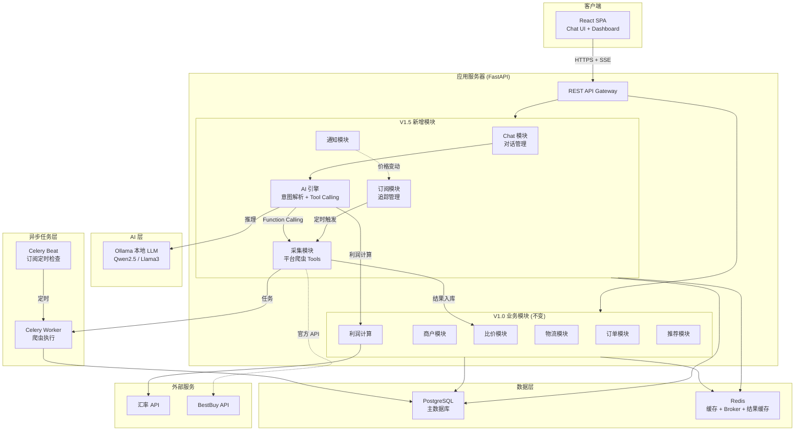
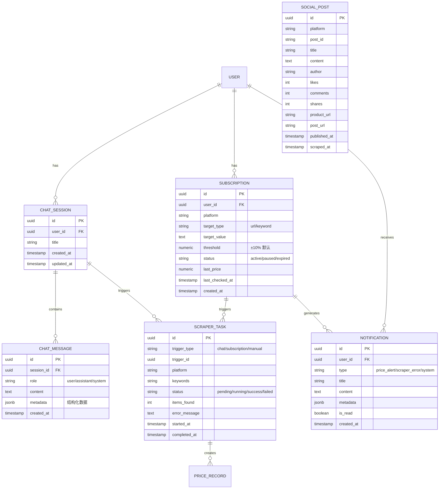
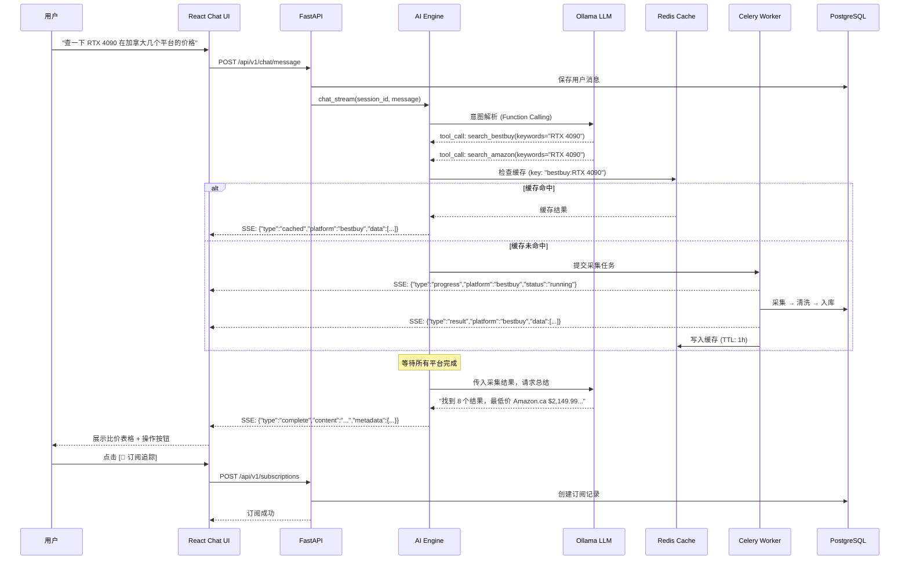

# North Link V1.5 — 系统架构文档（AI 对话驱动按需采集）

> 版本: V1.5 | 更新时间: 2026-03-01 | 作者: Bob (System Architect)
>
> 依赖: [需求分析](../requirements/requirements.md) | [PRD](../requirements/prd.md) | [UX 设计](../design/ux-design.md) | [V1.0 架构](../../architecture/system-architecture.md)

---

## 1. 架构概述

### 1.1 设计原则 (继承 V1.0 + 新增)

| 原则                         | 说明                                 | 实践                                        |
| ---------------------------- | ------------------------------------ | ------------------------------------------- |
| **Modular Monolith** (继承)  | MVP 模块化单体                       | 新增 `chat`、`scraper`、`subscription` 模块 |
| **AI as Tool Orchestrator**  | LLM 不直接操作数据，而是编排工具调用 | Function Calling → 爬虫 Tool → 结果返回     |
| **On-Demand, Not Scheduled** | 按需采集替代全量定时                 | 仅用户订阅的商品做定时检查                  |
| **Cost-Aware**               | 所有采集行为可计量                   | 使用量上限 + 缓存 + 按平台统计              |
| **Fail Gracefully** (继承)   | 任意组件不可用时系统仍可工作         | AI 降级 fallback UI + 单平台失败不影响全局  |
| **Multi-User Ready**         | 数据层预留多用户隔离                 | 所有关键表含 `user_id` FK                   |

### 1.2 架构决策记录 (ADR)

#### ADR-004: AI Chat 为核心交互入口

- **决策**: 用 Chat Box 替代传统的采集监控面板
- **理由**: 用户无需理解爬虫配置；自然语言降低使用门槛；按需采集控制成本
- **权衡**: 依赖 LLM 质量；偶尔意图误判
- **缓解**: Fallback UI (手动关键词+平台选择)

#### ADR-005: 本地 LLM 优先

- **决策**: 使用 Ollama 运行本地大模型（Qwen2.5/Llama3/DeepSeek），而非云端 API
- **理由**: 零 API 成本；数据隐私；无网络依赖；响应延迟可控
- **权衡**: 需要 GPU 服务器资源；模型质量可能不如 GPT-4o
- **缓解**: 可选配云端 API 作为高质量 fallback

#### ADR-006: SSE 流式返回

- **决策**: Chat API 使用 Server-Sent Events (SSE)，而非 WebSocket
- **理由**: FastAPI 原生支持 `StreamingResponse`；单向推送满足需求；部署更简单
- **权衡**: SSE 不支持双向通信
- **缓解**: 用户消息通过 POST 发送，SSE 只负责 AI 回复流式推送

#### ADR-007: 爬虫作为 AI Tool

- **决策**: 各平台爬虫封装为 LLM Function Calling 的 Tool
- **理由**: LLM 自动选择合适的平台和参数；统一的调用接口；易扩展新平台
- **数据流**: 用户输入 → LLM 解析 → 调用 Tool → Celery 异步执行 → SSE 推送结果

### 1.3 系统架构图



---

## 2. V1.5 新增技术选型

| 组件           | 技术选择                            | 版本   | 选型理由                                    |
| -------------- | ----------------------------------- | ------ | ------------------------------------------- |
| LLM 运行时     | **Ollama**                          | latest | 本地部署；支持多模型热切换；API 兼容 OpenAI |
| LLM 模型       | **Qwen2.5-72B / Llama3-70B**        | -      | Function Calling 能力强；中英文双语支持     |
| LLM SDK        | **openai** Python SDK               | 1.x    | Ollama 兼容 OpenAI API，同一套代码          |
| SSE            | **FastAPI StreamingResponse**       | -      | 框架内置，无额外依赖                        |
| SSE 前端       | **EventSource API** / fetch stream  | -      | 浏览器原生支持                              |
| 爬虫 (CA 电商) | httpx + parsel / Playwright stealth | -      | 按平台反爬难度选型                          |
| 爬虫 (BestBuy) | 官方 Developer API                  | -      | 零反爬                                      |
| 爬虫 (CN 电商) | PriceDive / Alibaba-CLI-Scraper     | -      | 覆盖多平台                                  |
| 爬虫 (社交)    | MediaCrawler                        | -      | 7 平台一体                                  |
| 爬虫 (闲鱼)    | ai-goofish-monitor                  | -      | Playwright + AI 过滤                        |

> V1.0 技术栈 (FastAPI, React, PostgreSQL, Redis, Celery, Docker) 全部继承。

---

## 3. 系统组件

### 3.1 新增后端模块

```
backend/app/modules/
├── chat/                    # 模块: AI 对话
│   ├── __init__.py
│   ├── models.py            # ChatSession, ChatMessage ORM
│   ├── schemas.py           # Request/Response Pydantic
│   ├── router.py            # /api/v1/chat/* 路由
│   ├── service.py           # 对话管理逻辑
│   └── ai_engine.py         # LLM 调用 + Function Calling 编排
│
├── scraper/                 # 模块: 按需数据采集
│   ├── __init__.py
│   ├── models.py            # ScraperTask ORM
│   ├── schemas.py
│   ├── router.py            # /api/v1/scraper/* (使用量统计等)
│   ├── service.py           # 采集任务管理
│   ├── cache.py             # 结果缓存 (Redis TTL 1h)
│   └── tools/               # LLM Function Calling Tools
│       ├── __init__.py
│       ├── base.py           # BaseTool 抽象类
│       ├── bestbuy.py        # BestBuy API Tool
│       ├── amazon.py         # Amazon Scraper Tool
│       ├── walmart.py        # Walmart Scraper Tool
│       ├── costco.py         # Costco Scraper Tool
│       ├── jd.py             # JD (PriceDive) Tool
│       ├── taobao.py         # Taobao Tool
│       ├── pinduoduo.py      # PDD Tool
│       ├── alibaba_1688.py   # 1688 Tool
│       ├── xiaohongshu.py    # 小红书 (MediaCrawler) Tool
│       ├── douyin.py         # 抖音 (MediaCrawler) Tool
│       ├── xianyu.py         # 闲鱼 (ai-goofish) Tool
│       └── social.py         # 其他社交平台 (MediaCrawler) Tool
│
├── subscription/            # 模块: 订阅追踪
│   ├── __init__.py
│   ├── models.py            # Subscription ORM
│   ├── schemas.py
│   ├── router.py            # /api/v1/subscriptions/*
│   ├── service.py           # 订阅管理逻辑
│   └── checker.py           # 定时检查逻辑 (Celery Beat 调用)
│
└── notification/            # 模块: 通知
    ├── __init__.py
    ├── models.py            # Notification ORM
    ├── schemas.py
    ├── router.py            # /api/v1/notifications/*
    └── service.py           # 通知创建 + 管理
```

### 3.2 新增前端页面/组件

```
frontend/src/
├── pages/
│   ├── Chat/                # AI 对话页面
│   │   ├── Chat.tsx          # 主页面布局
│   │   ├── Chat.css
│   │   ├── ChatSessionList.tsx
│   │   ├── ChatMessageList.tsx
│   │   ├── ChatInput.tsx
│   │   ├── ChatWelcome.tsx
│   │   └── ChatFallback.tsx
│   └── Subscriptions/       # 订阅管理页面
│       ├── Subscriptions.tsx
│       └── Subscriptions.css
│
├── components/
│   ├── chat/                # Chat 富文本组件
│   │   ├── ProductCard.tsx
│   │   ├── PriceCompareTable.tsx
│   │   ├── ProfitCalcCard.tsx
│   │   ├── SocialPostCard.tsx
│   │   └── ScraperProgress.tsx
│   ├── common/
│   │   ├── NotificationBell.tsx
│   │   ├── NotificationDrawer.tsx
│   │   ├── UsageIndicator.tsx
│   │   ├── PriceSourceTag.tsx
│   │   └── SubscriptionCard.tsx
│   └── dashboard/
│       └── QuickQueryCard.tsx
│
├── services/
│   ├── chatService.ts        # Chat API + SSE
│   ├── subscriptionService.ts
│   ├── notificationService.ts
│   └── scraperService.ts     # 使用量统计
│
├── hooks/
│   ├── useChat.ts            # Chat 状态管理 Hook
│   ├── useSSE.ts             # SSE 连接管理 Hook
│   └── useSubscriptions.ts
│
├── stores/
│   └── useChatStore.ts       # Chat 状态 (Zustand)
│
└── types/
    ├── chat.ts               # Chat 类型定义
    ├── subscription.ts
    └── notification.ts
```

### 3.3 AI Engine 核心设计

```
┌─────────────────────────────────────────────────────────────┐
│                      AI Engine (ai_engine.py)                │
│                                                              │
│  ┌──────────┐    ┌────────────────┐    ┌─────────────────┐  │
│  │ 用户输入  │───▶│  Ollama LLM    │───▶│  Tool Dispatch  │  │
│  │ (自然语言) │    │  (意图解析)     │    │  (Function Call) │  │
│  └──────────┘    └────────────────┘    └────────┬────────┘  │
│                                                  │           │
│              ┌──────────────────────────────────┤           │
│              ▼              ▼             ▼      ▼           │
│        ┌──────────┐  ┌──────────┐  ┌─────────────────┐      │
│        │ BestBuy  │  │ Amazon   │  │ MediaCrawler    │ ...  │
│        │ Tool     │  │ Tool     │  │ Tool            │      │
│        └────┬─────┘  └────┬─────┘  └───────┬─────────┘      │
│              │              │               │                │
│              ▼              ▼               ▼                │
│        ┌──────────────────────────────────────────┐          │
│        │            Celery (异步执行)              │          │
│        │  → 采集 → 清洗 → 入库 → SSE 推送结果     │          │
│        └──────────────────────────────────────────┘          │
│                                                              │
│  ┌────────────────────────────────────┐                      │
│  │ LLM 结果总结 (第二次调用)           │                      │
│  │ 采集结果 → 自然语言总结 + 结构化数据 │                      │
│  └────────────────────────────────────┘                      │
└─────────────────────────────────────────────────────────────┘
```

#### Function Calling Tool 接口

```python
# backend/app/modules/scraper/tools/base.py

class BaseTool(ABC):
    """LLM Function Calling Tool 基类"""

    name: str               # Tool 名称，LLM 用于选择
    description: str        # Tool 描述，LLM 用于理解
    parameters: dict        # JSON Schema，LLM 用于填参

    @abstractmethod
    async def execute(self, **kwargs) -> ToolResult:
        """执行采集任务"""
        ...

    def to_openai_function(self) -> dict:
        """转换为 OpenAI Function Calling 格式"""
        return {
            "name": self.name,
            "description": self.description,
            "parameters": self.parameters,
        }


class ToolResult:
    """Tool 执行结果"""
    success: bool
    data: list[dict]       # 采集到的商品/帖子数据
    error: str | None
    platform: str
    cached: bool           # 是否来自缓存
    items_count: int
```

#### Ollama 集成

```python
# backend/app/modules/chat/ai_engine.py

from openai import AsyncOpenAI  # Ollama 兼容 OpenAI API

class AIEngine:
    def __init__(self):
        self.client = AsyncOpenAI(
            base_url="http://localhost:11434/v1",  # Ollama
            api_key="ollama",  # Ollama 不需要真实 key
        )
        self.tools = ToolRegistry.get_all_tools()

    async def chat_stream(self, session_id, user_message):
        """流式对话 + Tool Calling"""
        # 1. 发送给 LLM，获取意图
        response = await self.client.chat.completions.create(
            model="qwen2.5:72b",
            messages=messages,
            tools=[t.to_openai_function() for t in self.tools],
            stream=True,
        )

        # 2. 如果 LLM 选择了 Tool → 异步执行
        # 3. SSE 推送采集进度
        # 4. 采集完成 → LLM 总结结果
        # 5. SSE 推送最终回复
```

---

## 4. 数据架构

### 4.1 V1.5 新增表 ER 图



### 4.2 Chat Message metadata JSON Schema

对话消息中的 `metadata` JSONB 字段格式规范：

```json
{
  "type": "price_compare",
  "scraper_task_ids": ["uuid1", "uuid2"],
  "results": {
    "platforms": ["amazon_ca", "bestbuy_ca"],
    "items": [
      {
        "platform": "amazon_ca",
        "product_name": "RTX 4090",
        "price": 2149.99,
        "currency": "CAD",
        "url": "https://...",
        "image_url": "https://...",
        "stock_status": "in_stock",
        "rating": 4.7,
        "scraped_at": "2026-03-01T12:00:00Z"
      }
    ],
    "summary": {
      "lowest_price": { "platform": "amazon_ca", "price": 2149.99 },
      "highest_price": { "platform": "walmart_ca", "price": 2299.99 }
    }
  },
  "actions": ["subscribe", "favorite", "compare"]
}
```

### 4.3 核心数据流



---

## 5. API 设计 (V1.5 新增)

### 5.1 Chat API — `/api/v1/chat`

| 方法   | 路径                  | 描述                    | 返回类型   |
| ------ | --------------------- | ----------------------- | ---------- |
| POST   | `/chat/message`       | 发送消息 + 触发 AI 处理 | SSE Stream |
| GET    | `/chat/sessions`      | 获取会话列表            | JSON       |
| GET    | `/chat/sessions/{id}` | 获取会话详情 + 消息历史 | JSON       |
| DELETE | `/chat/sessions/{id}` | 删除会话                | JSON       |

#### POST `/chat/message` — SSE 事件格式

```
event: thinking
data: {"type":"thinking","content":"正在分析您的需求..."}

event: tool_call
data: {"type":"tool_call","tool":"search_bestbuy","params":{"keywords":"RTX 4090"}}

event: progress
data: {"type":"progress","platform":"bestbuy_ca","status":"running"}

event: progress
data: {"type":"progress","platform":"bestbuy_ca","status":"done","items":3}

event: result
data: {"type":"result","platform":"bestbuy_ca","items":[...]}

event: content
data: {"type":"content","content":"找到 8 个结果...","metadata":{...}}

event: done
data: {"type":"done","message_id":"uuid"}
```

### 5.2 Subscription API — `/api/v1/subscriptions`

| 方法   | 路径                  | 描述              |
| ------ | --------------------- | ----------------- |
| POST   | `/subscriptions`      | 创建订阅          |
| GET    | `/subscriptions`      | 获取订阅列表      |
| PUT    | `/subscriptions/{id}` | 更新订阅 (暂停等) |
| DELETE | `/subscriptions/{id}` | 删除订阅          |

### 5.3 Notification API — `/api/v1/notifications`

| 方法 | 路径                          | 描述         |
| ---- | ----------------------------- | ------------ |
| GET  | `/notifications`              | 获取通知列表 |
| PUT  | `/notifications/{id}/read`    | 标记已读     |
| GET  | `/notifications/unread-count` | 未读数量     |

### 5.4 Scraper Usage API — `/api/v1/scraper`

| 方法 | 路径             | 描述           |
| ---- | ---------------- | -------------- |
| GET  | `/scraper/usage` | 获取使用量统计 |

---

## 6. 安全架构 (V1.5 扩展)

| 安全措施            | 实现                                       |
| ------------------- | ------------------------------------------ |
| LLM 输入过滤        | 过滤 prompt injection 攻击                 |
| 对话数据隔离        | `chat_sessions.user_id` 强制过滤           |
| 订阅数据隔离        | `subscriptions.user_id` 强制过滤           |
| Cookie/API Key 加密 | AES-256 加密存储在环境变量                 |
| 爬虫日志脱敏        | 不记录完整 Cookie / 代理凭证               |
| LLM 不传隐私数据    | 仅传 keywords + platform，不传用户个人信息 |
| 采集频率限制        | 每日上限 100 次/用户                       |

---

## 7. 部署架构 (V1.5 扩展)

### 7.1 Docker Compose 新增服务

```yaml
# docker-compose.yml (新增部分)
services:
  # ... V1.0 服务不变 (db, redis, api, frontend)

  ollama:
    image: ollama/ollama:latest
    ports: ["11434:11434"]
    volumes:
      - ollama_data:/root/.ollama
    deploy:
      resources:
        reservations:
          devices:
            - driver: nvidia
              count: 1
              capabilities: [gpu]

  celery-worker:
    build: ./backend
    command: uv run celery -A app.tasks.celery_app worker --loglevel=info --concurrency=4
    environment:
      DATABASE_URL: postgresql+asyncpg://northlink:${DB_PASSWORD}@db:5432/northlink
      REDIS_URL: redis://redis:6379
      OLLAMA_URL: http://ollama:11434
    depends_on: [db, redis, ollama]

  celery-beat:
    build: ./backend
    command: uv run celery -A app.tasks.celery_app beat --loglevel=info
    environment:
      DATABASE_URL: postgresql+asyncpg://northlink:${DB_PASSWORD}@db:5432/northlink
      REDIS_URL: redis://redis:6379
    depends_on: [db, redis]

volumes:
  ollama_data:
```

### 7.2 环境变量 (新增)

| 变量                | 说明                      | 默认值                   |
| ------------------- | ------------------------- | ------------------------ |
| `OLLAMA_URL`        | Ollama API 地址           | `http://localhost:11434` |
| `OLLAMA_MODEL`      | 默认模型                  | `qwen2.5:72b`            |
| `DAILY_LIMIT`       | 每日采集上限              | `100`                    |
| `CACHE_TTL`         | 结果缓存时长 (秒)         | `3600`                   |
| `MAX_SUBSCRIPTIONS` | 每用户最大订阅数          | `20`                     |
| `BESTBUY_API_KEY`   | BestBuy Developer API Key | (必须配置)               |

---

## 8. 扩展性考虑

### 8.1 新增爬虫平台

添加新平台只需：

1. 在 `scraper/tools/` 下新建 `xxx.py`，继承 `BaseTool`
2. 实现 `execute()` 方法
3. 注册到 `ToolRegistry`
4. LLM 自动可用（通过 Function Calling description 理解）

### 8.2 切换 LLM

Ollama 兼容 OpenAI API，切换模型只需改 `OLLAMA_MODEL` 环境变量。
切换到云端 API 只需改 `OLLAMA_URL` 为 `https://api.openai.com/v1` + 配置真实 API Key。

### 8.3 多用户扩展

- 所有表已含 `user_id`
- 需新增: 用户注册流程 + 权限中间件 + 使用量按用户隔离
- 预估工作量: 2-3 天
