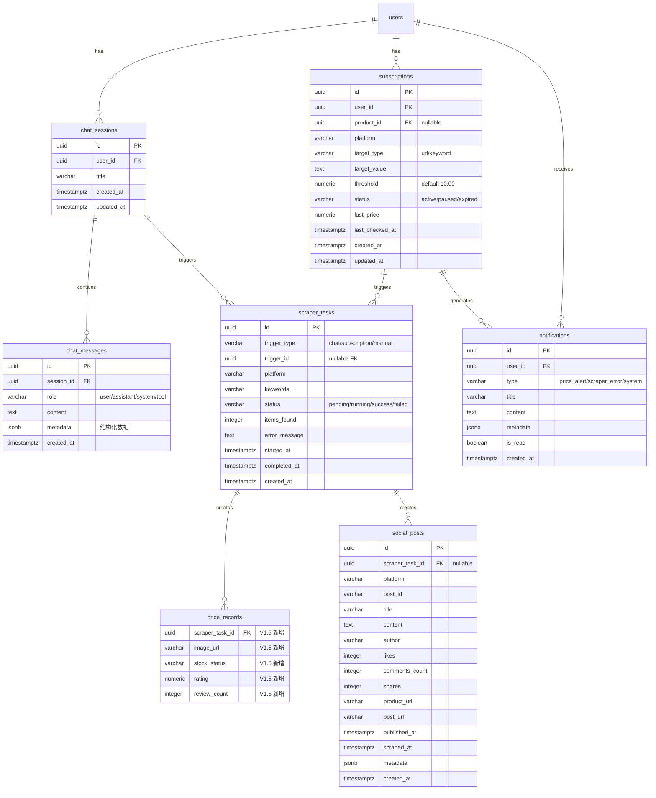
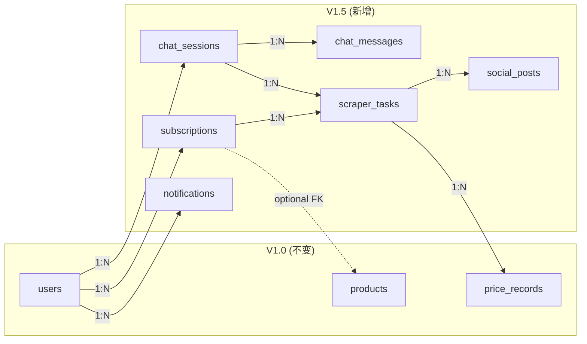

# North Link V1.5 — 数据库设计文档（增量）

> 版本: V1.5 | 日期: 2026-03-01 | 作者: Bob (System Architect)
>
> 依赖: [V1.0 数据库设计](../../codemaps/database.md) | [系统架构](../architecture/system-architecture.md) | [PRD](../requirements/prd.md)

---

## 1. 概述

### 1.1 变更范围

V1.5 在 V1.0 的 15 张表基础上：

| 操作    | 数量    | 说明                                                                                    |
| ------- | ------- | --------------------------------------------------------------------------------------- |
| 🆕 新增 | 6 张表  | chat_sessions, chat_messages, scraper_tasks, subscriptions, notifications, social_posts |
| 🔄 扩展 | 1 张表  | price_records 新增 5 个字段                                                             |
| ✅ 不变 | 14 张表 | V1.0 所有其他表不做任何修改                                                             |

### 1.2 技术栈 (继承 V1.0)

| 项目     | 值                     |
| -------- | ---------------------- |
| RDBMS    | PostgreSQL 16          |
| ORM      | SQLAlchemy 2.0 (async) |
| 迁移工具 | Alembic                |
| 驱动     | asyncpg                |
| 缓存     | Redis 7                |

### 1.3 命名规范 (继承 V1.0)

| 规则   | 格式                  | V1.5 示例                         |
| ------ | --------------------- | --------------------------------- |
| 表名   | 小写复数 snake_case   | `chat_sessions`, `scraper_tasks`  |
| 字段名 | snake_case            | `trigger_type`, `last_checked_at` |
| 主键   | `id` (UUID)           | `id UUID PRIMARY KEY`             |
| 外键   | `{entity}_id`         | `session_id`, `subscription_id`   |
| 时间戳 | `_at` 后缀            | `started_at`, `completed_at`      |
| 布尔值 | `is_` 前缀            | `is_read`                         |
| 索引   | `ix_{table}_{column}` | `ix_chat_messages_session_id`     |

---

## 2. ER 图 (V1.5 新增部分)



### 2.1 与 V1.0 表的关系



---

## 3. 新增表结构

### 3.1 chat_sessions — 对话会话

| 字段       | 类型         | 约束                          | 说明                   |
| ---------- | ------------ | ----------------------------- | ---------------------- |
| id         | UUID         | PK, DEFAULT gen_random_uuid() | 主键                   |
| user_id    | UUID         | FK → users.id, NOT NULL       | 所属用户               |
| title      | VARCHAR(200) | NULLABLE                      | 会话标题 (AI 自动生成) |
| created_at | TIMESTAMPTZ  | NOT NULL, DEFAULT now()       | 创建时间               |
| updated_at | TIMESTAMPTZ  | NOT NULL, DEFAULT now()       | 更新时间               |

**索引**:

- `ix_chat_sessions_user_id` (user_id) — 用户的会话列表查询
- `ix_chat_sessions_updated_at` (updated_at DESC) — 按最近活跃排序

**外键级联**: user_id → users.id ON DELETE CASCADE (用户删除时清除对话)

---

### 3.2 chat_messages — 对话消息

| 字段       | 类型        | 约束                            | 说明                                   |
| ---------- | ----------- | ------------------------------- | -------------------------------------- |
| id         | UUID        | PK, DEFAULT gen_random_uuid()   | 主键                                   |
| session_id | UUID        | FK → chat_sessions.id, NOT NULL | 所属会话                               |
| role       | VARCHAR(20) | NOT NULL                        | 角色: user / assistant / system / tool |
| content    | TEXT        | NOT NULL                        | 消息内容                               |
| metadata   | JSONB       | DEFAULT '{}'                    | 结构化数据 (采集结果/图表等)           |
| created_at | TIMESTAMPTZ | NOT NULL, DEFAULT now()         | 创建时间                               |

**metadata JSON Schema** (参见架构文档 §4.2):

```json
{
  "type": "price_compare | social_search | profit_calc | ...",
  "scraper_task_ids": ["uuid1", "uuid2"],
  "results": {
    "platforms": ["amazon_ca", "bestbuy_ca"],
    "items": [{ "platform": "...", "product_name": "...", "price": 0.0 }],
    "summary": { "lowest_price": {}, "highest_price": {} }
  },
  "actions": ["subscribe", "favorite", "compare"]
}
```

**索引**:

- `ix_chat_messages_session_id` (session_id) — 会话的消息列表
- `ix_chat_messages_created_at` (created_at) — 时间排序

**外键级联**: session_id → chat_sessions.id ON DELETE CASCADE

---

### 3.3 scraper_tasks — 采集任务记录

| 字段          | 类型         | 约束                          | 说明                                   |
| ------------- | ------------ | ----------------------------- | -------------------------------------- |
| id            | UUID         | PK, DEFAULT gen_random_uuid() | 主键                                   |
| trigger_type  | VARCHAR(20)  | NOT NULL                      | 触发类型: chat / subscription / manual |
| trigger_id    | UUID         | NULLABLE                      | 关联的 session_id 或 subscription_id   |
| platform      | VARCHAR(30)  | NOT NULL                      | 平台标识                               |
| keywords      | VARCHAR(200) | NOT NULL                      | 搜索关键词                             |
| status        | VARCHAR(20)  | NOT NULL, DEFAULT 'pending'   | 状态                                   |
| items_found   | INTEGER      | NOT NULL, DEFAULT 0           | 找到的商品数                           |
| error_message | TEXT         | NULLABLE                      | 错误信息                               |
| started_at    | TIMESTAMPTZ  | NULLABLE                      | 开始时间                               |
| completed_at  | TIMESTAMPTZ  | NULLABLE                      | 完成时间                               |
| created_at    | TIMESTAMPTZ  | NOT NULL, DEFAULT now()       | 创建时间                               |

> **设计决策**: `trigger_id` 不使用 FK 约束，因为它可能指向 chat_sessions 或 subscriptions 两种不同的表。通过 `trigger_type` 区分。这是一种多态关联模式。

**索引**:

- `ix_scraper_tasks_trigger` (trigger_type, trigger_id) — 按触发源查询
- `ix_scraper_tasks_platform` (platform) — 按平台统计
- `ix_scraper_tasks_status` (status) — 任务状态筛选
- `ix_scraper_tasks_created_at` (created_at DESC) — 使用量统计

**状态机**:

```
pending → running → success
                  → failed
```

---

### 3.4 subscriptions — 订阅追踪

| 字段            | 类型          | 约束                          | 说明                    |
| --------------- | ------------- | ----------------------------- | ----------------------- |
| id              | UUID          | PK, DEFAULT gen_random_uuid() | 主键                    |
| user_id         | UUID          | FK → users.id, NOT NULL       | 所属用户                |
| product_id      | UUID          | FK → products.id, NULLABLE    | 关联商品 (可选)         |
| platform        | VARCHAR(30)   | NOT NULL                      | 平台标识                |
| target_type     | VARCHAR(20)   | NOT NULL                      | 追踪类型: url / keyword |
| target_value    | TEXT          | NOT NULL                      | 具体 URL 或关键词       |
| threshold       | NUMERIC(5,2)  | NOT NULL, DEFAULT 10.00       | 变动通知阈值 (%)        |
| status          | VARCHAR(20)   | NOT NULL, DEFAULT 'active'    | 状态                    |
| last_price      | NUMERIC(12,2) | NULLABLE                      | 最近一次采集价格        |
| last_checked_at | TIMESTAMPTZ   | NULLABLE                      | 最近一次检查时间        |
| created_at      | TIMESTAMPTZ   | NOT NULL, DEFAULT now()       | 创建时间                |
| updated_at      | TIMESTAMPTZ   | NOT NULL, DEFAULT now()       | 更新时间                |

> **解决 PRD Review MEDIUM #3**: `product_id` (可选 FK) 关联 `products` 表，
> 当订阅对应具体商品 URL 时关联已有商品记录，用于查看价格历史 (复用 price_records)。
> 当订阅类型为关键词时 product_id 为 NULL。

**索引**:

- `ix_subscriptions_user_id` (user_id) — 用户的订阅列表
- `ix_subscriptions_status` (status) — 活跃订阅筛选 (Celery Beat 用)
- `ix_subscriptions_user_status` (user_id, status) — 用户活跃订阅计数 (限额检查)

**外键级联**:

- user_id → users.id ON DELETE CASCADE
- product_id → products.id ON DELETE SET NULL

**状态机**:

```
active ⇄ paused → expired
```

**业务约束**: 每用户最多 20 个 status='active' 的订阅 (应用层检查)

---

### 3.5 notifications — 通知

| 字段       | 类型         | 约束                          | 说明                       |
| ---------- | ------------ | ----------------------------- | -------------------------- |
| id         | UUID         | PK, DEFAULT gen_random_uuid() | 主键                       |
| user_id    | UUID         | FK → users.id, NOT NULL       | 所属用户                   |
| type       | VARCHAR(20)  | NOT NULL                      | 通知类型                   |
| title      | VARCHAR(200) | NOT NULL                      | 通知标题                   |
| content    | TEXT         | NULLABLE                      | 通知内容                   |
| metadata   | JSONB        | DEFAULT '{}'                  | 扩展数据 (关联商品/订阅等) |
| is_read    | BOOLEAN      | NOT NULL, DEFAULT false       | 是否已读                   |
| created_at | TIMESTAMPTZ  | NOT NULL, DEFAULT now()       | 创建时间                   |

**metadata 示例** (price_alert):

```json
{
  "subscription_id": "uuid",
  "product_name": "RTX 4090",
  "platform": "amazon_ca",
  "old_price": 2149.99,
  "new_price": 1889.99,
  "change_pct": -12.1,
  "currency": "CAD"
}
```

**索引**:

- `ix_notifications_user_read` (user_id, is_read) — 用户未读通知查询
- `ix_notifications_created_at` (created_at DESC) — 时间排序

**外键级联**: user_id → users.id ON DELETE CASCADE

---

### 3.6 social_posts — 社交平台采集数据

| 字段            | 类型         | 约束                            | 说明                   |
| --------------- | ------------ | ------------------------------- | ---------------------- |
| id              | UUID         | PK, DEFAULT gen_random_uuid()   | 主键                   |
| scraper_task_id | UUID         | FK → scraper_tasks.id, NULLABLE | 关联采集任务           |
| platform        | VARCHAR(30)  | NOT NULL                        | 平台标识               |
| post_id         | VARCHAR(100) | NOT NULL                        | 平台原始帖子 ID        |
| title           | VARCHAR(500) | NULLABLE                        | 标题                   |
| content         | TEXT         | NULLABLE                        | 内容摘要               |
| author          | VARCHAR(100) | NULLABLE                        | 作者昵称               |
| likes           | INTEGER      | NOT NULL, DEFAULT 0             | 点赞数                 |
| comments_count  | INTEGER      | NOT NULL, DEFAULT 0             | 评论数                 |
| shares          | INTEGER      | NOT NULL, DEFAULT 0             | 分享/转发数            |
| product_url     | VARCHAR(500) | NULLABLE                        | 关联商品链接 (如有)    |
| post_url        | VARCHAR(500) | NULLABLE                        | 原始帖子链接           |
| published_at    | TIMESTAMPTZ  | NULLABLE                        | 发布时间               |
| scraped_at      | TIMESTAMPTZ  | NOT NULL, DEFAULT now()         | 采集时间               |
| metadata        | JSONB        | DEFAULT '{}'                    | 扩展数据 (标签/图片等) |
| created_at      | TIMESTAMPTZ  | NOT NULL, DEFAULT now()         | 创建时间               |

> **命名**: `comments_count` 而非 `comments`，避免与 ORM relationship 命名冲突。

**索引**:

- `uq_social_posts_platform_post_id` (platform, post_id, UNIQUE) — 去重
- `ix_social_posts_scraper_task_id` (scraper_task_id) — 按任务查询
- `ix_social_posts_platform` (platform) — 按平台筛选

**外键级联**: scraper_task_id → scraper_tasks.id ON DELETE SET NULL

---

## 4. 现有表扩展

### 4.1 price_records — 新增字段

| 字段            | 类型         | 约束                            | 说明                    |
| --------------- | ------------ | ------------------------------- | ----------------------- |
| scraper_task_id | UUID         | FK → scraper_tasks.id, NULLABLE | 关联采集任务 (V1.5新增) |
| image_url       | VARCHAR(500) | NULLABLE                        | 商品主图 (V1.5新增)     |
| stock_status    | VARCHAR(20)  | NULLABLE                        | 库存状态 (V1.5新增)     |
| rating          | NUMERIC(3,1) | NULLABLE                        | 评分 (V1.5新增)         |
| review_count    | INTEGER      | NULLABLE                        | 评论数 (V1.5新增)       |

**新增索引**:

- `ix_price_records_scraper_task_id` (scraper_task_id)

**stock_status 枚举值**: `in_stock`, `out_of_stock`, `limited`, `unknown`

**外键级联**: scraper_task_id → scraper_tasks.id ON DELETE SET NULL

> **向后兼容**: 所有新增字段均为 NULLABLE，V1.0 已有的价格记录不受影响。

---

## 5. 数据字典 (V1.5 新增枚举)

### 5.1 新增枚举值

| 字段                       | 可选值                                                                                                                                                                                  | 说明       |
| -------------------------- | --------------------------------------------------------------------------------------------------------------------------------------------------------------------------------------- | ---------- |
| chat_messages.role         | `user`, `assistant`, `system`, `tool`                                                                                                                                                   | 消息角色   |
| scraper_tasks.trigger_type | `chat`, `subscription`, `manual`                                                                                                                                                        | 触发来源   |
| scraper_tasks.status       | `pending`, `running`, `success`, `failed`                                                                                                                                               | 任务状态   |
| scraper_tasks.platform     | `amazon_ca`, `bestbuy_ca`, `walmart_ca`, `costco_ca`, `jd`, `taobao`, `pinduoduo`, `alibaba_1688`, `xiaohongshu`, `douyin`, `xianyu`, `weibo`, `bilibili`, `kuaishou`, `zhihu`, `tieba` | 支持的平台 |
| subscriptions.target_type  | `url`, `keyword`                                                                                                                                                                        | 追踪类型   |
| subscriptions.status       | `active`, `paused`, `expired`                                                                                                                                                           | 订阅状态   |
| notifications.type         | `price_alert`, `scraper_error`, `system`                                                                                                                                                | 通知类型   |
| price_records.stock_status | `in_stock`, `out_of_stock`, `limited`, `unknown`                                                                                                                                        | 库存状态   |

### 5.2 price_records.source 扩展

V1.0 已有: `amazon`, `bestbuy`, `costco`, `walmart`, `canada_computers`, `newegg`, `manual`, `csv`

V1.5 新增: `jd`, `taobao`, `pinduoduo`, `alibaba_1688`, `ai_scraper`

---

## 6. 外键与级联规则 (V1.5 新增)

| 子表          | 外键            | 父表          | ON DELETE | 理由                     |
| ------------- | --------------- | ------------- | --------- | ------------------------ |
| chat_sessions | user_id         | users         | CASCADE   | 用户删除时清除对话       |
| chat_messages | session_id      | chat_sessions | CASCADE   | 会话删除时清除消息       |
| subscriptions | user_id         | users         | CASCADE   | 用户删除时清除订阅       |
| subscriptions | product_id      | products      | SET NULL  | 商品删除后订阅仍保留     |
| notifications | user_id         | users         | CASCADE   | 用户删除时清除通知       |
| social_posts  | scraper_task_id | scraper_tasks | SET NULL  | 任务删除后帖子仍保留     |
| price_records | scraper_task_id | scraper_tasks | SET NULL  | 任务删除后价格记录仍保留 |

---

## 7. 索引策略 (V1.5 新增总表)

| 表            | 索引名                           | 字段                     | 类型   | 用途         |
| ------------- | -------------------------------- | ------------------------ | ------ | ------------ |
| chat_sessions | ix_chat_sessions_user_id         | user_id                  | BTREE  | 用户会话列表 |
| chat_sessions | ix_chat_sessions_updated_at      | updated_at DESC          | BTREE  | 最近活跃排序 |
| chat_messages | ix_chat_messages_session_id      | session_id               | BTREE  | 会话消息列表 |
| chat_messages | ix_chat_messages_created_at      | created_at               | BTREE  | 时间排序     |
| scraper_tasks | ix_scraper_tasks_trigger         | trigger_type, trigger_id | BTREE  | 按触发源查询 |
| scraper_tasks | ix_scraper_tasks_platform        | platform                 | BTREE  | 按平台统计   |
| scraper_tasks | ix_scraper_tasks_status          | status                   | BTREE  | 任务状态筛选 |
| scraper_tasks | ix_scraper_tasks_created_at      | created_at DESC          | BTREE  | 使用量日统计 |
| subscriptions | ix_subscriptions_user_id         | user_id                  | BTREE  | 用户订阅列表 |
| subscriptions | ix_subscriptions_status          | status                   | BTREE  | 活跃订阅查询 |
| subscriptions | ix_subscriptions_user_status     | user_id, status          | BTREE  | 限额检查     |
| notifications | ix_notifications_user_read       | user_id, is_read         | BTREE  | 未读通知查询 |
| notifications | ix_notifications_created_at      | created_at DESC          | BTREE  | 时间排序     |
| social_posts  | uq_social_posts_platform_post_id | platform, post_id        | UNIQUE | 去重         |
| social_posts  | ix_social_posts_scraper_task_id  | scraper_task_id          | BTREE  | 按任务查询   |
| social_posts  | ix_social_posts_platform         | platform                 | BTREE  | 按平台筛选   |
| price_records | ix_price_records_scraper_task_id | scraper_task_id          | BTREE  | 按任务查询   |

---

## 8. 性能考虑

### 8.1 数据量预估 (V1.5 第一年)

| 表            | 预估行数       | 增长速率      | 说明              |
| ------------- | -------------- | ------------- | ----------------- |
| chat_sessions | 500 - 2,000    | 10/天         | 每日多次对话      |
| chat_messages | 5,000 - 20,000 | 100/天        | 每会话 ~10 条消息 |
| scraper_tasks | 5,000 - 36,500 | 100/天 (上限) | 每日上限 100 次   |
| subscriptions | 20 - 100       | 2/周          | 每用户上限 20     |
| notifications | 1,000 - 5,000  | 10/天         | 价格变动通知      |
| social_posts  | 5,000 - 50,000 | 500/周        | 社交平台采集      |

### 8.2 查询优化

| 查询场景                   | 优化策略                                        |
| -------------------------- | ----------------------------------------------- |
| 用户会话列表 (高频)        | ix_chat_sessions_user_id + updated_at DESC 排序 |
| 会话消息历史 (高频)        | ix_chat_messages_session_id + 分页              |
| 采集使用量统计             | ix_scraper_tasks_created_at + 按日聚合          |
| 活跃订阅检查 (Celery Beat) | ix_subscriptions_status WHERE status='active'   |
| 未读通知计数 (高频)        | ix_notifications_user_read + COUNT              |
| 社交帖子去重               | uq_social_posts_platform_post_id 唯一约束       |

### 8.3 Redis 缓存策略

| 缓存 Key                                  | TTL          | 用途           |
| ----------------------------------------- | ------------ | -------------- |
| `scraper:cache:{platform}:{keywords_md5}` | 3600s (1h)   | 采集结果缓存   |
| `scraper:usage:{user_id}:{date}`          | 86400s (1天) | 每日使用量计数 |
| `notification:unread:{user_id}`           | 300s (5min)  | 未读通知数缓存 |
| `subscription:active_count:{user_id}`     | 600s (10min) | 活跃订阅数缓存 |

### 8.4 归档策略

- chat_messages: 超过 6 个月的历史对话消息归档
- scraper_tasks: 超过 3 个月且 status=success/failed 归档
- social_posts: 超过 6 个月归档
- notifications: 超过 1 个月且 is_read=true 归档

---

## 9. Migration 计划

| 版本 | 描述                                  | Alembic 命令                                                           |
| ---- | ------------------------------------- | ---------------------------------------------------------------------- |
| 003  | V1.5 新增 6 张表                      | `uv run alembic revision --autogenerate -m "v15_new_tables"`           |
| 004  | price_records 扩展 5 字段             | `uv run alembic revision --autogenerate -m "v15_extend_price_records"` |
| 005  | V1.5 种子数据 (settings 新增 AI 配置) | `uv run alembic revision -m "v15_seed_data"`                           |

### 9.1 V1.5 种子数据

settings 表新增:

| key                            | value                               | description      |
| ------------------------------ | ----------------------------------- | ---------------- |
| ai_ollama_url                  | `{"url": "http://localhost:11434"}` | Ollama API 地址  |
| ai_default_model               | `{"model": "qwen2.5:72b"}`          | 默认 LLM 模型    |
| scraper_daily_limit            | `{"limit": 100}`                    | 每日采集次数上限 |
| scraper_cache_ttl              | `{"seconds": 3600}`                 | 采集结果缓存时长 |
| subscription_max_per_user      | `{"limit": 20}`                     | 每用户最大订阅数 |
| subscription_default_threshold | `{"percent": 10.0}`                 | 默认通知阈值     |

---

## 10. 与架构文档的一致性检查

| 架构文档引用                | 数据库设计对应                | 状态      |
| --------------------------- | ----------------------------- | --------- |
| §3.1 chat/ 模块             | chat_sessions + chat_messages | ✅        |
| §3.1 scraper/ 模块          | scraper_tasks                 | ✅        |
| §3.1 subscription/ 模块     | subscriptions                 | ✅        |
| §3.1 notification/ 模块     | notifications                 | ✅        |
| §4.1 ER 图                  | 本文档 §2 ER 图               | ✅        |
| §4.2 metadata JSON Schema   | chat_messages.metadata + §3.2 | ✅        |
| PRD §5.1 social_posts       | social_posts 表               | ✅        |
| PRD §5.2 price_records 扩展 | §4.1 新增 5 字段              | ✅        |
| PRD Review #3 订阅-价格关联 | subscriptions.product_id FK   | ✅ 已解决 |
