# North Link V1.5 — 开发任务清单 (Sprint Plan)

> 作者: Charlie (Tech Lead) | 日期: 2026-03-01
> 依赖: [PRD](../requirements/prd.md) | [架构](../architecture/system-architecture.md) | [UX](../design/ux-design.md)

---

## 概览

- **Epic 数量**: 4
- **Story 总数**: 52
- **预估总工时**: ~120h
- **Sprint 数量**: 5 (对齐 PRD §6 优先级)

### Epic 总览

| Epic | 名称         | Story 数 | 预估 | 优先级 |
| ---- | ------------ | -------- | ---- | ------ |
| E1   | AI Chat 对话 | 20       | 48h  | P0     |
| E2   | 按需数据采集 | 16       | 36h  | P0     |
| E3   | 订阅追踪     | 10       | 22h  | P1     |
| E4   | 采集成本控制 | 6        | 14h  | P1     |

---

## Sprint 规划

### Sprint 1: Chat + AI + BestBuy 全链路 (4-5天)

> 目标: 跑通 Chat→AI→采集→展示 完整链路

| ID     | 标题                                                                                                      | 类型     | Epic | 优先级 | 预估 | 依赖           |
| ------ | --------------------------------------------------------------------------------------------------------- | -------- | ---- | ------ | ---- | -------------- |
| DB-001 | V1.5 新增表迁移 (chat_sessions, chat_messages, scraper_tasks, subscriptions, notifications, social_posts) | Database | E1   | P0     | 3h   | -              |
| DB-002 | price_records 表扩展字段                                                                                  | Database | E2   | P0     | 1h   | DB-001         |
| BE-001 | Chat Model + Schema                                                                                       | Backend  | E1   | P0     | 2h   | DB-001         |
| BE-002 | Chat Service (会话 CRUD)                                                                                  | Backend  | E1   | P0     | 2h   | BE-001         |
| BE-003 | Chat Router (REST + SSE)                                                                                  | Backend  | E1   | P0     | 3h   | BE-002         |
| BE-004 | AI Engine 核心 (Ollama 集成 + Function Calling)                                                           | Backend  | E1   | P0     | 4h   | BE-001         |
| BE-005 | BaseTool 抽象 + ToolRegistry                                                                              | Backend  | E2   | P0     | 2h   | -              |
| BE-006 | BestBuy API Tool                                                                                          | Backend  | E2   | P0     | 3h   | BE-005         |
| BE-007 | Scraper Task Model + Service                                                                              | Backend  | E2   | P0     | 2h   | DB-001         |
| BE-008 | 采集结果缓存 (Redis TTL)                                                                                  | Backend  | E2   | P0     | 2h   | BE-007         |
| BE-009 | SSE 流式推送 (StreamingResponse)                                                                          | Backend  | E1   | P0     | 3h   | BE-003, BE-004 |
| FE-001 | Chat 页面布局 + 路由                                                                                      | Frontend | E1   | P0     | 3h   | -              |
| FE-002 | ChatSessionList 组件                                                                                      | Frontend | E1   | P0     | 2h   | FE-001         |
| FE-003 | ChatMessageList + 消息气泡                                                                                | Frontend | E1   | P0     | 3h   | FE-001         |
| FE-004 | ChatInput 组件                                                                                            | Frontend | E1   | P0     | 2h   | FE-001         |
| FE-005 | ChatWelcome 空状态                                                                                        | Frontend | E1   | P0     | 1h   | FE-001         |
| FE-006 | chatService (API + SSE 客户端)                                                                            | Frontend | E1   | P0     | 3h   | FE-001         |
| FE-007 | useChat + useSSE Hooks                                                                                    | Frontend | E1   | P0     | 2h   | FE-006         |
| FE-008 | useChatStore (Zustand)                                                                                    | Frontend | E1   | P0     | 2h   | FE-007         |

### Sprint 2: 加拿大平台 + 结果展示 (3-4天)

> 目标: Amazon/Walmart/Costco 采集 + 富文本组件

| ID     | 标题                                     | 类型     | Epic | 优先级 | 预估 | 依赖           |
| ------ | ---------------------------------------- | -------- | ---- | ------ | ---- | -------------- |
| BE-010 | Amazon Scraper Tool (Playwright stealth) | Backend  | E2   | P0     | 4h   | BE-005         |
| BE-011 | Walmart Scraper Tool (httpx + parsel)    | Backend  | E2   | P0     | 3h   | BE-005         |
| BE-012 | Costco Scraper Tool (Playwright stealth) | Backend  | E2   | P0     | 4h   | BE-005         |
| BE-013 | Celery 异步任务集成                      | Backend  | E2   | P0     | 3h   | BE-007         |
| BE-014 | Worker→API SSE 桥接 (Redis Pub/Sub)      | Backend  | E1   | P0     | 3h   | BE-009, BE-013 |
| FE-009 | PriceCompareTable 组件                   | Frontend | E1   | P0     | 3h   | FE-003         |
| FE-010 | ProductCard 组件                         | Frontend | E1   | P0     | 2h   | FE-003         |
| FE-011 | ScraperProgress 组件                     | Frontend | E1   | P0     | 2h   | FE-003         |
| FE-012 | Chat 类型定义 (types/chat.ts)            | Frontend | E1   | P0     | 1h   | -              |

### Sprint 3: 中国电商 + 利润计算 (3-4天)

> 目标: 京东/拼多多/1688 + 利润计算场景

| ID     | 标题                            | 类型     | Epic | 优先级 | 预估 | 依赖   |
| ------ | ------------------------------- | -------- | ---- | ------ | ---- | ------ |
| BE-015 | JD Tool (PriceDive)             | Backend  | E2   | P1     | 3h   | BE-005 |
| BE-016 | PDD Tool (PriceDive)            | Backend  | E2   | P1     | 2h   | BE-005 |
| BE-017 | 1688 Tool (Alibaba-CLI-Scraper) | Backend  | E2   | P1     | 3h   | BE-005 |
| BE-018 | 利润计算服务 (汇率 + 成本)      | Backend  | E2   | P1     | 3h   | BE-007 |
| FE-013 | ProfitCalcCard 组件             | Frontend | E1   | P1     | 2h   | FE-003 |
| FE-014 | PriceSourceTag 组件             | Frontend | E2   | P1     | 1h   | -      |

### Sprint 4: 社交平台 + 订阅追踪 (4-5天)

> 目标: 小红书/抖音/闲鱼 + 订阅功能

| ID     | 标题                                  | 类型     | Epic | 优先级 | 预估 | 依赖           |
| ------ | ------------------------------------- | -------- | ---- | ------ | ---- | -------------- |
| BE-019 | 小红书 Tool (MediaCrawler)            | Backend  | E2   | P1     | 3h   | BE-005         |
| BE-020 | 抖音 Tool (MediaCrawler)              | Backend  | E2   | P1     | 2h   | BE-005         |
| BE-021 | 闲鱼 Tool (ai-goofish)                | Backend  | E2   | P1     | 3h   | BE-005         |
| BE-022 | Subscription Model + Schema           | Backend  | E3   | P1     | 2h   | DB-001         |
| BE-023 | Subscription Service + Router         | Backend  | E3   | P1     | 3h   | BE-022         |
| BE-024 | Subscription Checker (Celery Beat)    | Backend  | E3   | P1     | 3h   | BE-023, BE-013 |
| BE-025 | Notification Model + Schema           | Backend  | E3   | P1     | 1h   | DB-001         |
| BE-026 | Notification Service + Router         | Backend  | E3   | P1     | 2h   | BE-025         |
| FE-015 | SocialPostCard 组件                   | Frontend | E1   | P1     | 2h   | FE-003         |
| FE-016 | Subscriptions 页面                    | Frontend | E3   | P1     | 3h   | -              |
| FE-017 | SubscriptionCard 组件                 | Frontend | E3   | P1     | 2h   | FE-016         |
| FE-018 | subscriptionService.ts                | Frontend | E3   | P1     | 1h   | -              |
| FE-019 | NotificationBell + NotificationDrawer | Frontend | E3   | P1     | 3h   | -              |
| FE-020 | notificationService.ts                | Frontend | E3   | P1     | 1h   | -              |

### Sprint 5: 困难平台 + 成本控制 + 优化 (4-5天)

> 目标: 淘宝/Costco 优化 + 成本面板 + 全局优化

| ID     | 标题                                    | 类型     | Epic | 优先级 | 预估 | 依赖           |
| ------ | --------------------------------------- | -------- | ---- | ------ | ---- | -------------- |
| BE-027 | 淘宝 Tool (需登录态)                    | Backend  | E2   | P2     | 4h   | BE-005         |
| BE-028 | Scraper Usage Service + Router          | Backend  | E4   | P1     | 2h   | BE-007         |
| BE-029 | 每日采集上限检查中间件                  | Backend  | E4   | P1     | 2h   | BE-028         |
| BE-030 | ChatFallback 降级逻辑 (Ollama 健康检查) | Backend  | E1   | P1     | 2h   | BE-004         |
| FE-021 | UsageIndicator 组件                     | Frontend | E4   | P1     | 2h   | -              |
| FE-022 | QuickQueryCard (Dashboard)              | Frontend | E4   | P1     | 2h   | -              |
| FE-023 | Dashboard 改动 (通知+使用量)            | Frontend | E4   | P1     | 2h   | FE-019, FE-021 |
| FE-024 | ChatFallback 组件                       | Frontend | E1   | P1     | 2h   | FE-001         |
| FE-025 | 系统设置 AI 配置 Tab                    | Frontend | E4   | P2     | 3h   | -              |
| FE-026 | 比价中心改动 (AI查询+来源标签)          | Frontend | E4   | P2     | 2h   | FE-014         |
| FE-027 | 导航更新 (AI助手+订阅追踪)              | Frontend | E1   | P0     | 1h   | FE-001, FE-016 |

---

## 依赖图

```mermaid
graph TD
    subgraph Database
        DB001["DB-001 V1.5 新增表"]
        DB002["DB-002 price_records 扩展"]
    end

    subgraph "Backend - Chat & AI"
        BE001["BE-001 Chat Model"]
        BE002["BE-002 Chat Service"]
        BE003["BE-003 Chat Router"]
        BE004["BE-004 AI Engine"]
        BE009["BE-009 SSE 推送"]
        BE014["BE-014 Worker→SSE 桥接"]
        BE030["BE-030 Fallback 降级"]
    end

    subgraph "Backend - Scraper"
        BE005["BE-005 BaseTool"]
        BE006["BE-006 BestBuy"]
        BE007["BE-007 Scraper Task"]
        BE008["BE-008 Redis 缓存"]
        BE010["BE-010 Amazon"]
        BE011["BE-011 Walmart"]
        BE012["BE-012 Costco"]
        BE013["BE-013 Celery 集成"]
        BE015["BE-015 JD"]
        BE016["BE-016 PDD"]
        BE017["BE-017 1688"]
        BE018["BE-018 利润计算"]
        BE019["BE-019 小红书"]
        BE020["BE-020 抖音"]
        BE021["BE-021 闲鱼"]
        BE027["BE-027 淘宝"]
    end

    subgraph "Backend - Subscription"
        BE022["BE-022 Sub Model"]
        BE023["BE-023 Sub Service"]
        BE024["BE-024 Celery Beat"]
        BE025["BE-025 Notify Model"]
        BE026["BE-026 Notify Service"]
    end

    subgraph "Backend - Cost"
        BE028["BE-028 Usage Service"]
        BE029["BE-029 限额中间件"]
    end

    DB001 --> BE001
    DB001 --> BE007
    DB001 --> BE022
    DB001 --> BE025
    DB002 --> BE007
    BE001 --> BE002
    BE002 --> BE003
    BE001 --> BE004
    BE003 --> BE009
    BE004 --> BE009
    BE005 --> BE006
    BE005 --> BE010
    BE005 --> BE011
    BE005 --> BE012
    BE005 --> BE015
    BE005 --> BE016
    BE005 --> BE017
    BE005 --> BE019
    BE005 --> BE020
    BE005 --> BE021
    BE005 --> BE027
    BE007 --> BE008
    BE007 --> BE013
    BE009 --> BE014
    BE013 --> BE014
    BE013 --> BE024
    BE022 --> BE023
    BE023 --> BE024
    BE025 --> BE026
    BE007 --> BE028
    BE028 --> BE029
    BE004 --> BE030
```

```mermaid
graph TD
    subgraph "Frontend - Chat"
        FE001["FE-001 Chat 布局"]
        FE002["FE-002 SessionList"]
        FE003["FE-003 MessageList"]
        FE004["FE-004 ChatInput"]
        FE005["FE-005 Welcome"]
        FE006["FE-006 chatService"]
        FE007["FE-007 Hooks"]
        FE008["FE-008 Store"]
        FE009["FE-009 比价表格"]
        FE010["FE-010 商品卡片"]
        FE011["FE-011 进度条"]
        FE012["FE-012 类型定义"]
        FE013["FE-013 利润卡片"]
        FE015["FE-015 社交卡片"]
        FE024["FE-024 Fallback"]
    end

    subgraph "Frontend - Subscription"
        FE016["FE-016 订阅页面"]
        FE017["FE-017 订阅卡片"]
        FE018["FE-018 订阅Service"]
        FE019["FE-019 通知组件"]
        FE020["FE-020 通知Service"]
    end

    subgraph "Frontend - Dashboard"
        FE014["FE-014 来源标签"]
        FE021["FE-021 使用量"]
        FE022["FE-022 快捷入口"]
        FE023["FE-023 Dashboard改动"]
        FE025["FE-025 AI配置"]
        FE026["FE-026 比价中心改动"]
        FE027["FE-027 导航更新"]
    end

    FE001 --> FE002
    FE001 --> FE003
    FE001 --> FE004
    FE001 --> FE005
    FE001 --> FE006
    FE001 --> FE024
    FE006 --> FE007
    FE007 --> FE008
    FE003 --> FE009
    FE003 --> FE010
    FE003 --> FE011
    FE003 --> FE013
    FE003 --> FE015
    FE016 --> FE017
    FE019 --> FE023
    FE021 --> FE023
    FE014 --> FE026
    FE001 --> FE027
    FE016 --> FE027
```

---

## Story 详情

下面列出每个 Story 的验收标准和目标文件。

---

### Epic 1: AI Chat 对话

#### [DB-001] V1.5 新增表迁移

**类型**: Database | **优先级**: P0 | **预估**: 3h

**描述**: 创建 V1.5 所有新增表的 Alembic 迁移脚本。

**验收标准**:

- [ ] 迁移脚本创建 6 张新表: chat_sessions, chat_messages, scraper_tasks, subscriptions, notifications, social_posts
- [ ] 所有表含正确的 FK 约束和索引
- [ ] `uv run alembic upgrade head` 执行成功
- [ ] `uv run alembic downgrade -1` 可回退

**文件**: `backend/alembic/versions/xxx_v15_new_tables.py`

---

#### [DB-002] price_records 表扩展字段

**类型**: Database | **优先级**: P0 | **预估**: 1h | **依赖**: DB-001

**描述**: 为 price_records 表新增 scraper_task_id, image_url, stock_status, rating, review_count 字段。

**验收标准**:

- [ ] 迁移脚本新增 5 个字段
- [ ] scraper_task_id 为可选 FK→scraper_tasks
- [ ] 迁移可正向/反向执行

**文件**: `backend/alembic/versions/xxx_extend_price_records.py`

---

#### [BE-001] Chat Model + Schema

**类型**: Backend | **优先级**: P0 | **预估**: 2h | **依赖**: DB-001

**描述**: 创建 ChatSession 和 ChatMessage 的 SQLAlchemy ORM 模型和 Pydantic Schema。

**验收标准**:

- [ ] `ChatSession` ORM: id, user_id, title, created_at, updated_at
- [ ] `ChatMessage` ORM: id, session_id, role, content, metadata(JSONB), created_at
- [ ] Pydantic Schema: Create/Update/Response 各模型
- [ ] metadata 字段遵循架构 §4.2 JSON Schema 规范

**文件**: `backend/app/modules/chat/models.py`, `backend/app/modules/chat/schemas.py`

---

#### [BE-002] Chat Service

**类型**: Backend | **优先级**: P0 | **预估**: 2h | **依赖**: BE-001

**描述**: 会话管理业务逻辑 (CRUD)。

**验收标准**:

- [ ] create_session, get_sessions, get_session_detail, delete_session
- [ ] get_session_detail 返回完整消息历史
- [ ] 数据隔离: 所有查询含 user_id 过滤

**文件**: `backend/app/modules/chat/service.py`

---

#### [BE-003] Chat Router

**类型**: Backend | **优先级**: P0 | **预估**: 3h | **依赖**: BE-002

**描述**: Chat API 路由，含 SSE 流式端点。

**验收标准**:

- [ ] POST `/api/v1/chat/message` → SSE StreamingResponse
- [ ] GET `/api/v1/chat/sessions` → 会话列表
- [ ] GET `/api/v1/chat/sessions/{id}` → 会话详情
- [ ] DELETE `/api/v1/chat/sessions/{id}` → 删除会话
- [ ] SSE 事件格式遵循架构 §5.1 定义

**文件**: `backend/app/modules/chat/router.py`

---

#### [BE-004] AI Engine 核心

**类型**: Backend | **优先级**: P0 | **预估**: 4h | **依赖**: BE-001

**描述**: Ollama LLM 集成 + Function Calling 编排。

**验收标准**:

- [ ] 使用 openai SDK 连接 Ollama (base_url 可配置)
- [ ] 自动注册 ToolRegistry 中的所有 Tools
- [ ] chat_stream() 方法实现: 意图解析 → Tool 调用 → 结果总结
- [ ] 支持上下文对话 (传入完整消息历史)
- [ ] 系统 prompt 定义 7 种意图类型

**文件**: `backend/app/modules/chat/ai_engine.py`

---

#### [BE-009] SSE 流式推送

**类型**: Backend | **优先级**: P0 | **预估**: 3h | **依赖**: BE-003, BE-004

**描述**: FastAPI StreamingResponse 实现 SSE 事件推送。

**验收标准**:

- [ ] 支持 6 种事件类型: thinking, tool_call, progress, result, content, done
- [ ] 正确设置 Content-Type: text/event-stream
- [ ] 连接断开时清理资源

**文件**: `backend/app/modules/chat/router.py` (SSE 部分)

---

#### [BE-014] Worker→API SSE 桥接

**类型**: Backend | **优先级**: P0 | **预估**: 3h | **依赖**: BE-009, BE-013

**描述**: 使用 Redis Pub/Sub 实现 Celery Worker 采集完成后通知 API 进程推送 SSE。

**验收标准**:

- [ ] Worker 完成采集后 publish 到 Redis channel
- [ ] API 进程 subscribe 对应 channel，推送 SSE
- [ ] channel 命名: `scraper:task:{task_id}`

**文件**: `backend/app/modules/scraper/pubsub.py`

---

#### [BE-030] ChatFallback 降级逻辑

**类型**: Backend | **优先级**: P1 | **预估**: 2h | **依赖**: BE-004

**描述**: Ollama 健康检查 + AI 不可用时的降级处理。

**验收标准**:

- [ ] 启动时检查 Ollama 连接
- [ ] 运行时检测 LLM 超时/不可用
- [ ] 降级时返回特殊 SSE 事件通知前端切换 Fallback UI
- [ ] 降级模式下直接调用爬虫 Tool (跳过 LLM)

**文件**: `backend/app/modules/chat/ai_engine.py`

---

### Epic 2: 按需数据采集

#### [BE-005] BaseTool + ToolRegistry

**类型**: Backend | **优先级**: P0 | **预估**: 2h

**描述**: 创建 LLM Function Calling Tool 基类和注册中心。

**验收标准**:

- [ ] `BaseTool` ABC: name, description, parameters, execute(), to_openai_function()
- [ ] `ToolResult` 数据类: success, data, error, platform, cached, items_count
- [ ] `ToolRegistry`: register(), get_all_tools(), get_tool_by_name()

**文件**: `backend/app/modules/scraper/tools/base.py`

---

#### [BE-006] BestBuy API Tool

**类型**: Backend | **优先级**: P0 | **预估**: 3h | **依赖**: BE-005

**验收标准**:

- [ ] 使用 BestBuy Developer API (需 BESTBUY_API_KEY)
- [ ] 搜索商品、获取价格/库存/评分
- [ ] 返回标准化 ToolResult
- [ ] 错误处理 (API 限流、无结果)

**文件**: `backend/app/modules/scraper/tools/bestbuy.py`

---

#### [BE-007] Scraper Task Model + Service

**类型**: Backend | **优先级**: P0 | **预估**: 2h | **依赖**: DB-001

**验收标准**:

- [ ] ScraperTask ORM 模型
- [ ] 创建/更新任务状态
- [ ] 按 trigger (chat/subscription) 查询

**文件**: `backend/app/modules/scraper/models.py`, `backend/app/modules/scraper/service.py`

---

#### [BE-008] 采集结果缓存

**类型**: Backend | **优先级**: P0 | **预估**: 2h | **依赖**: BE-007

**验收标准**:

- [ ] Redis 缓存 key 格式: `scraper:{platform}:{keywords_hash}`
- [ ] TTL 可配置 (默认 3600s)
- [ ] 缓存命中时标记 ToolResult.cached=True

**文件**: `backend/app/modules/scraper/cache.py`

---

#### [BE-010~012] Amazon/Walmart/Costco Tools

**类型**: Backend | **优先级**: P0 | **预估**: 11h | **依赖**: BE-005

每个 Tool 的验收标准:

- [ ] 继承 BaseTool, 实现 execute()
- [ ] 反爬策略 (UA轮换/随机延迟/stealth)
- [ ] 采集标准字段: product_name, sku, price, currency, stock_status, url, image_url, rating
- [ ] 错误处理 + 重试 (最多 2 次)

**文件**: `backend/app/modules/scraper/tools/amazon.py`, `walmart.py`, `costco.py`

---

#### [BE-013] Celery 异步任务集成

**类型**: Backend | **优先级**: P0 | **预估**: 3h | **依赖**: BE-007

**验收标准**:

- [ ] Celery app 配置 (broker=Redis)
- [ ] `scrape_task` 异步任务: 执行 Tool → 清洗 → 入库 → 发布结果
- [ ] 任务状态更新到 scraper_tasks 表
- [ ] 并发控制 (concurrency=4)

**文件**: `backend/app/tasks/celery_app.py`, `backend/app/tasks/scraper_tasks.py`

---

#### [BE-015~017] JD/PDD/1688 Tools

**类型**: Backend | **优先级**: P1 | **预估**: 8h | **依赖**: BE-005

同 CA 平台 Tool 验收标准 + CNY 货币 + 批发价字段 (1688)。

**文件**: `backend/app/modules/scraper/tools/jd.py`, `pinduoduo.py`, `alibaba_1688.py`

---

#### [BE-018] 利润计算服务

**类型**: Backend | **优先级**: P1 | **预估**: 3h | **依赖**: BE-007

**验收标准**:

- [ ] 自动获取 CAD/CNY 汇率 (复用 V1.0 汇率模块)
- [ ] 计算: 采购成本 + 运费 + 关税 → 利润率
- [ ] 返回结构化利润计算结果

**文件**: `backend/app/modules/scraper/profit.py`

---

#### [BE-019~021] 小红书/抖音/闲鱼 Tools

**类型**: Backend | **优先级**: P1 | **预估**: 8h | **依赖**: BE-005

**验收标准**:

- [ ] 小红书/抖音使用 MediaCrawler 集成
- [ ] 闲鱼使用 ai-goofish-monitor + AI 过滤
- [ ] 结果写入 social_posts 表
- [ ] 社交字段: title, content, author, likes, comments, shares

**文件**: `backend/app/modules/scraper/tools/xiaohongshu.py`, `douyin.py`, `xianyu.py`

---

#### [BE-027] 淘宝 Tool

**类型**: Backend | **优先级**: P2 | **预估**: 4h | **依赖**: BE-005

**验收标准**:

- [ ] 需登录态管理 (Cookie 缓存)
- [ ] 滑块验证处理
- [ ] 降级提示用户手动刷新

**文件**: `backend/app/modules/scraper/tools/taobao.py`

---

### Epic 3: 订阅追踪

#### [BE-022] Subscription Model + Schema

**类型**: Backend | **优先级**: P1 | **预估**: 2h | **依赖**: DB-001

**文件**: `backend/app/modules/subscription/models.py`, `schemas.py`

---

#### [BE-023] Subscription Service + Router

**类型**: Backend | **优先级**: P1 | **预估**: 3h | **依赖**: BE-022

**验收标准**:

- [ ] CRUD: 创建/列表/更新/删除订阅
- [ ] 每用户最多 20 个活跃订阅检查
- [ ] user_id 数据隔离

**文件**: `backend/app/modules/subscription/service.py`, `router.py`

---

#### [BE-024] Subscription Checker (Celery Beat)

**类型**: Backend | **优先级**: P1 | **预估**: 3h | **依赖**: BE-023, BE-013

**验收标准**:

- [ ] 定时任务: 每日 1-2 次检查活跃订阅
- [ ] 对每个订阅调用对应 Tool 采集
- [ ] 价格变动超阈值 → 创建通知
- [ ] 更新 subscription.last_price 和 last_checked_at

**文件**: `backend/app/modules/subscription/checker.py`

---

#### [BE-025~026] Notification Model + Service + Router

**类型**: Backend | **优先级**: P1 | **预估**: 3h | **依赖**: DB-001

**验收标准**:

- [ ] 通知 CRUD + 标记已读 + 未读计数
- [ ] 通知类型: price_alert, scraper_error, system
- [ ] user_id 数据隔离

**文件**: `backend/app/modules/notification/models.py`, `schemas.py`, `service.py`, `router.py`

---

### Epic 4: 采集成本控制

#### [BE-028] Scraper Usage Service + Router

**类型**: Backend | **优先级**: P1 | **预估**: 2h | **依赖**: BE-007

**验收标准**:

- [ ] GET `/api/v1/scraper/usage` → 今日次数/本月累计/按平台分布
- [ ] 从 scraper_tasks 表聚合统计

**文件**: `backend/app/modules/scraper/router.py`, `service.py`

---

#### [BE-029] 每日采集上限中间件

**类型**: Backend | **优先级**: P1 | **预估**: 2h | **依赖**: BE-028

**验收标准**:

- [ ] 检查今日采集次数 < DAILY_LIMIT
- [ ] 超限返回友好错误
- [ ] 限额可通过环境变量配置

**文件**: `backend/app/middleware/rate_limit.py`

---

### 前端 Story 详情 (FE-001~027)

> 前端 Story 的验收标准均包含: TypeScript 类型安全、Ant Design 组件库、暗色主题、响应式适配。
> 详细组件设计参见 [UX 设计文档](../design/ux-design.md)。

每个前端 Story 的通用验收标准:

- [ ] 组件 TypeScript 类型完整
- [ ] 遵循 UX 设计稿
- [ ] 暗色主题适配
- [ ] 响应式断点: ≥1200px / 768-1199px / <768px

---

## 遗留 MEDIUM 问题跟踪

| 来源    | 问题              | 解决 Sprint       |
| ------- | ----------------- | ----------------- |
| PRD #3  | 订阅-价格历史关联 | Sprint 4 (BE-022) |
| UX #2   | 会话列表搜索      | Sprint 5 (P2)     |
| Arch #1 | Worker→SSE 推送   | Sprint 2 (BE-014) |
